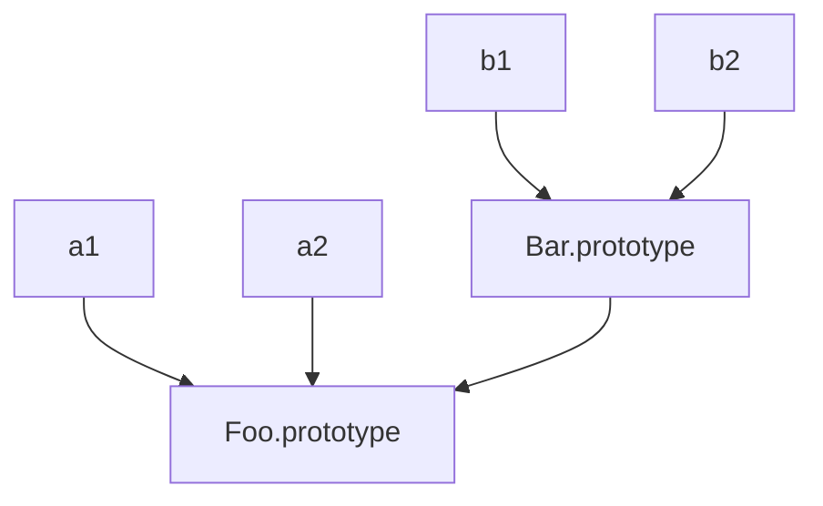

# 原型

## 1.`[[Prototype]]`

JavaScript 中的对象有一个特殊的 `[[Prototype]]` 内置属性，其实就是对于其他对象的引用。几乎所有的对象在创建时 `[[Prototype]]` 属性都会被赋予一个非空的值。

注意：很快我们就可以看到，对象的 `[[Prototype]]` 链接可以为空，虽然很少见。

思考下面的代码：

```js
const myObject = {
    a:2
};

myObject.a; // 2
```

`[[Prototype]]` 引用有什么用呢？当试图引用对象的属性时会触发 `[[Get]]` 操作，比如 `myObject.a`。对于默认的 `[[Get]]` 操作来说，第一步是检查对象本身是否有这个属性，如果有的话就使用它。

> 注意，如果包含 Proxy 的话，我们这里对 `[[Get]]` 和 `[[Put]]` 的讨论就不适用。

但是如果 `a` 不在 `myObject` 中，就需要使用对象的 `[[Prototype]]` 链了。

对于默认的 `[[Get]]` 操作来说，如果无法在对象本身找到需要的属性，就会继续访问对象的 `[[Prototype]]` 链：

```js
const anotherObject = {
    a:2
};

// 创建一个关联到 anotherObject 的对象
const myObject = Object.create(anotherObject);

myObject.a; // 2
```

现在 `myObject` 对象的 `[[Prototype]]` 关联到了 `anotherObject`。显然 `myObject.a` 并不存在，但是尽管如此，属性访问仍然成功地（在 `anotherObject` 中）找到了值 2。

但是，如果 `anotherObject` 中也找不到 `a` 并且 `[[Prototype]]` 链不为空的话，就会继续查找下去。这个过程会持续到找到匹配的属性名或者查找完整条 `[[Prototype]]` 链。如果是后者的话，`[[Get]]` 操作的返回值是 `undefined`。

使用 `for..in` 遍历对象时原理和查找 `[[Prototype]]` 链类似，任何可以通过原型链访问到（并且是 `enumerable`）的属性都会被枚举。使用 `in` 操作符来检查属性在对象中是否存在时，同样会查找对象的整条原型链（无论属性是否可枚举）：

```js
const anotherObject = {
    a:2
};

// 创建一个关联到 anotherObject 的对象
const myObject = Object.create(anotherObject);

for (const k in myObject) {
    console.log("found: " + k);
}
// found: a

("a" in myObject); // true
```

因此，当你通过各种语法进行属性查找时都会查找 `[[Prototype]]` 链，直到找到属性或者查找完整条原型链。

### 1.1.`Object.prototype`

但是到哪里是 `[[Prototype]]` 的“尽头”呢？

所有普通的 `[[Prototype]]` 链最终都会指向内置的 `Object.prototype`。由于所有的“普通”（内置，不是特定主机的扩展）对象都“源于”（或者说把 `[[Prototype]]` 链的顶端设置为）这个 `Object.prototype` 对象，所以它包含 JavaScript 中许多通用的功能。

### 1.2.属性设置和屏蔽

给一个对象设置属性并不仅仅是添加一个新属性或者修改已有的属性值：

```js
myObject.foo = "bar";
```

如果 `myObject` 对象中包含名为 `foo` 的普通数据访问属性，这条赋值语句只会修改已有的属性值；

如果 `foo` 不是直接存在于 `myObject` 中，`[[Prototype]]` 链就会被遍历，类似 `[[Get]]` 操作。如果原型链上找不到 `foo`，`foo` 就会被直接添加到 `myObject`上。然而，如果 `foo` 存在于原型链上层，赋值语句 `myObject.foo = "bar"` 的行为就会有些不同（而且可能很出人意料）；

如果属性名 `foo` 既出现在 `myObject` 中也出现在 `myObject` 的 `[[Prototype]]` 链上层，那么就会发生屏蔽。`myObject` 中包含的 `foo` 属性会屏蔽原型链上层的所有 `foo` 属性，因为 `myObject.foo` 总是会选择原型链中最底层的 `foo` 属性。

屏蔽比我们想象中更加复杂。下面我们分析一下如果 `foo` 不直接存在于 `myObject` 中而是存在于原型链上层时 `myObject.foo = "bar"` 会出现的三种情况。

```js
'use strict';

function Super() { }

// 使用 `=` 赋值操作定义的变量，不会有下述影响
Super.prototype.name = '张三';

Super.prototype.getName = function () {
  return this.name;
};

const sub = new Super();

sub.getName(); //张三
sub.hasOwnProperty('name'); //false

sub.name = '李四';
sub.hasOwnProperty('name'); //true
sub.getName(); //李四
```

---

- 如果在 `[[Prototype]]` 链上层存在 `foo` 的普通数据访问属性，并且没有被标记为只读（`writable:false`），那就会直接在 `myObject` 中添加一个名为 `foo` 的新属性，它是屏蔽属性；

```js
function Super() { }

Object.defineProperty(Super.prototype, 'name', {
  value: '张三',
  writable: true,
  configurable: true
})

Super.prototype.getName = function () {
  return this.name;
};

const sub = new Super();

sub.getName(); // 张三
sub.hasOwnProperty('name'); // false

sub.name = '李四';

sub.getName(); // 李四
sub.hasOwnProperty('name'); // true
```

---

- 如果在 `[[Prototype]]` 链上层存在 `foo`，但是它被标记为只读（`writable:false`），那么无法修改已有属性或者在 `myObject` 上创建屏蔽属性。如果运行在严格模式下，代码会抛出一个错误。否则，这条赋值语句会被忽略。总之，不会发生屏蔽。

```js
function Super() { }

Object.defineProperty(Super.prototype, 'name', {
  value: '张三',
  writable: false,
  configurable: true
})

Super.prototype.getName = function () {
  return this.name;
};

const sub = new Super();

sub.getName(); // 张三
sub.hasOwnProperty('name'); // false

// 'use strict' model
// Cannot assign to read only property 'name' of object
sub.name = '李四';

sub.getName(); // 张三
sub.hasOwnProperty('name'); // false
```

---

- 如果在 `[[Prototype]]` 链上层存在 `foo` 并且它是一个 `setter`，那就一定会调用这个 `setter`（即 `[[prototype]]` 链上 `foo` 被修改值）。`foo` 不会被添加到（或者说屏蔽于）`myObject`，也不会重新定义 `foo` 这个 `setter`。

```js
let name = '张三';

function Super() { }

Object.defineProperty(Super.prototype, 'name', {
  configurable: true,
  get() {
    return name
  },
  set(val) {
    console.log('set name');
    name = val;
  }
})

Super.prototype.getName = function () {
  return this.name;
};

const sub = new Super();

sub.getName(); // 张三
sub.hasOwnProperty('name'); // false

sub.name = '李四';

sub.hasOwnProperty('name'); // false
sub.getName(); // 李四
```

大多数开发者都认为如果向 `[[Prototype]]` 链上层已经存在的属性（`[[Put]]`）赋值，就一定会触发屏蔽，但是如你所见，三种情况中只有一种（第一种）是这样的。

如果你希望在第二种和第三种情况下也屏蔽 `foo`，那就不能使用 `=` 操作符来赋值，而是使用 `Object.defineProperty` 来向 `myObject` 添加 `foo`。

```js
// sub.name = '李四';
Object.defineProperty(sub, 'name', {
  value: '李四'
})
```

> 第二种情况可能是最令人意外的，【只读属性】会阻止 `[[Prototype]]` 链下层隐式创建（屏蔽）同名属性。这样做主要是为了模拟类属性的继承。你可以把原型链上层的 `foo` 看作是父类中的属性，它会被 `myObject` 继承（复制），这样一来 `myObject` 中的 `foo` 属性也是只读，所以无法创建。但是一定要注意，实际上并不会发生类似的继承复制。这看起来有点奇怪，`myObject`对象竟然会因为其他对象中有一个只读 `foo` 就不能包含 `foo` 属性。更奇怪的是，这个限制只存在于 `=` 赋值中，使用 `Object.defineProperty` 并不会受到影响。

如果需要对屏蔽方法进行委托的话就不得不使用丑陋的显式伪多态。通常来说，使用屏蔽得不偿失，所以应当尽量避免使用。有些情况下会隐式产生屏蔽，一定要当心。思考下面的代码：

```js
const anotherObject = {};
// const _a_ = 2;

Object.defineProperty(anotherObject, 'a', {
  value: 2,
  writable: true
  // get(){
  //   return _a_;
  // },
  // set(val){
  //   _a_ = val;
  // }
})

const myObject = Object.create(anotherObject);

anotherObject.a; // 2
myObject.a; // 2

anotherObject.hasOwnProperty("a"); // true
myObject.hasOwnProperty("a"); // false

// 自动创建新属性
myObject.a++; // 隐式屏蔽！

anotherObject.a; // 2
myObject.a; // 3

myObject.hasOwnProperty("a"); // true
```

尽管 `myObject.a++` 看起来应该（通过委托）查找并增加 `anotherObject.a` 属性，但是别忘了 `++` 操作相当于 `myObject.a = myObject.a + 1`。因此 `++` 操作首先会通过 `[[Prototype]]` 查找属性 `a` 并从 `anotherObject.a` 获取当前属性值 2，然后给这个值加 1，接着用 `[[Put]]` 将值 3 赋给 `myObject` 中新建的屏蔽属性 `a`，天呐！

修改委托属性时一定要小心。如果想让 `anotherObject.a` 的值增加，唯一的办法是 `anotherObject.a++`。

## 2.类

现在你可能会很好奇：为什么一个对象需要关联到另一个对象？这样做有什么好处？这个问题非常好，但是在回答之前我们首先要理解 `[[Prototype]]` “不是”什么。JavaScript 和面向类的语言不同，它并没有类来作为对象的抽象模式或者说蓝图。JavaScript 中只有对象。

实际上，JavaScript 才是真正应该被称为“面向对象”的语言，因为它是少有的可以不通过类，直接创建对象的语言。

在 JavaScript 中，类无法描述对象的行为，（因为根本就不存在类！）对象直接定义自己的行为。再说一遍，JavaScript 中只有对象。

### 2.1.“类”函数

多年以来，JavaScript 中有一种奇怪的行为一直在被“无耻”地滥用，那就是模仿类。我们会仔细分析这种方法。

这种奇怪的“类似类”的行为利用了函数的一种特殊特性：所有的函数默认都会拥有一个名为 `prototype` 的公有并且不可枚举的属性，它会指向另一个对象：

```js
function Foo() {
    // ...
}

Foo.prototype; // { }
```

这个对象通常被称为 `Foo` 的 **原型**，因为我们通过名为 `Foo.prototype` 的属性引用来访问它。然而不幸的是，这个术语对我们造成了极大的误导，稍后我们就会看到。

抛开名字不谈，这个对象到底是什么？

最直接的解释就是，通过调用 `new Foo` 创建的每个对象将最终（有点武断地）被 `[[Prototype]]` 链接到这个 “`Foo.prototype`” 对象。

我们来验证一下：

```js
function Foo() {
    // ...
}

const a = new Foo();

Object.getPrototypeOf(a) === Foo.prototype; // true
```

调用 `new Foo` 时会创建 `a`，其中一步就是将 `a` 内部的 `[[Prototype]]` 链接到 `Foo.prototype` 所指向的对象。

暂停一下，仔细思考这条语句的含义。

在面向类的语言中，类可以被 **复制**（或者说实例化）多次，就像用模具制作东西一样。之所以会这样是因为实例化（或者继承）一个类就意味着“把类的行为复制到物理对象中”，对于每一个新实例来说都会重复这个过程。【但是在 JavaScript 中，并没有类似的复制机制】。你不能创建一个类的多个实例，只能创建多个对象，它们 `[[Prototype]]` 关联的是同一个对象。但是在默认情况下并不会进行复制，因此这些对象之间并不会完全失去联系，它们是互相关联的。

`new Foo` 会生成一个新对象（我们称之为实例 `a`），这个新对象的内部链接 `[[Prototype]]` 关联的是 `Foo.prototype` 对象。

最后我们得到了两个对象，它们之间互相关联，就是这样。我们并没有初始化一个类，实际上我们并没有从“类”中复制任何行为到一个对象中，只是让两个对象互相关联。

实际上，绝大多数 JavaScript 开发者不知道的秘密是，`new Foo` 这个函数调用实际上并没有直接创建关联，这个关联只是一个意外的副作用。`new Foo` 只是间接完成了我们的目标：一个关联到其他对象的新对象。

那么有没有更直接的方法来做到这一点呢？当然！功臣就是 `Object.create`。

- **关于名称**

在 JavaScript 中，我们并不会将一个对象（“类”）复制到另一个对象（“实例”），只是将它们关联起来。从视觉角度来说，`[[Prototype]]` 机制如下图所示，箭头从右到左，从下到上：



这个机制通常被称为 **原型继承**（稍后我们会分析具体代码），它常常被视为动态语言版本的类继承。这个名称主要是为了对应面向类的世界中“继承”的意义，但是违背了动态脚本中对应的语义。

“继承”这个词会让人产生非常强的心理预期。仅仅在前面加上“原型”并不能区分出 JavaScript 中和类继承几乎完全相反的行为，因此在过去 20 年中造成了极大的误解。

在我看来，在“继承”前面加上“原型”对于事实的曲解就好像一只手拿橘子一只手拿苹果然后把苹果叫作“红橘子”一样。无论添加什么标签都无法改变事实：一种水果是苹果，另一种是橘子。

更好的方法是直接把苹果叫作苹果——使用更加准确并且直接的术语。这样有助于理解它们的相似之处以及不同之处，因为我们大家都明白“苹果”的含义。

因此我认为这个容易混淆的组合术语“原型继承”（以及使用其他面向类的术语比如“类”、“构造函数”、“实例”、“多态”，等等）严重影响了大家对于 JavaScript 机制真实原理的理解。

*继承意味着复制操作，JavaScript（默认）并不会复制对象属性。相反，JavaScript 会在两个对象之间创建一个关联，这样一个对象就可以通过委托访问另一个对象的属性和函数*。【委托】这个术语可以更加准确地描述 JavaScript 中对象的关联机制。

还有个偶尔会用到的 JavaScript 术语 **差异继承**。基本原则是在描述对象行为时，使用其不同于普遍描述的特质。举例来说，描述汽车时你会说汽车是有四个轮子的一种交通工具，但是你不会重复描述交通工具具备的通用特性（比如引擎）。

如果你把 JavaScript 中对象的所有委托行为都归结到对象本身并且把对象看作是实物的话，那就（差不多）可以理解差异继承了。

但是和原型继承一样，差异继承会更多是你脑中构建出的模型，而非真实情况。它忽略了一个事实，那就是对象 `B` 实际上并不是被差异构造出来的，我们只是定义了 `B` 的一些指定特性，其他没有定义的东西都变成了“洞”。而这些洞（或者说缺少定义的空白处）最终会被委托行为“填满”。

默认情况下，对象并不会像差异继承暗示的那样通过复制生成。因此，差异继承也不适合用来描述 JavaScript 的 `[[Prototype]]` 机制。

当然，如果你喜欢，完全可以使用差异继承这个术语，但是无论如何它只适用于你脑中的模型，并不符合引擎的真实行为。

### 2.2.“构造函数”

```js
function Foo() {
  // ...
}

const a = new Foo();
```

到底是什么让我们认为 `Foo` 是一个“类”呢？

其中一个原因是我们看到了关键字 `new`，在面向类的语言中构造类实例时也会用到它。另一个原因是，看起来我们执行了类的构造函数方法，`Foo` 的调用方式很像初始化类时类构造函数的调用方式。

除了令人迷惑的“构造函数”语义外，`Foo.prototype` 还有另一个绝招。思考下面的代码：

```js
function Foo() {
  // ...
}

Foo.prototype.constructor === Foo; // true

const a = new Foo();
a.constructor === Foo; // true
```

`Foo.prototype` 默认（在代码中第一行声明时！）有一个公有并且不可枚举的属性 `.constructor`，这个属性引用的是对象关联的函数（本例中是 `Foo`）。此外，我们可以看到通过“构造函数”调用 `new Foo` 创建的对象也有一个 `.constructor` 属性，指向“创建这个对象的函数”。

> 实际上 `a` 本身并没有 `.constructor` 属性。而且，虽然 `a.constructor` 确实指向 `Foo` 函数，但是这个属性并不是表示 `a` 由 `Foo` “构造”。（而是“继承”的，更确切的说是通过原型链，从 `Foo.prototype` 上读取的）

哦耶，好吧……按照 JavaScript 世界的惯例，“类”名首字母要大写，所以名字写 `Foo` 而非 `foo` 似乎也提示它是一个“类”。显而易见，是吧？!

这个惯例影响力非常大，以至于如果你用 `new` 来调用小写方法或者不用 `new` 调用首字母大写的函数，许多 JavaScript 开发者都会责怪你。这很令人吃惊，我们竟然会如此努力地维护 JavaScript 中（假）“面向类”的权力，尽管对于 JavaScript 引擎来说首字母大写没有任何意义。

- **构造函数还是调用**

上一段代码很容易让人认为 `Foo` 是一个构造函数，因为我们使用 `new` 来调用它并且看到它“构造”了一个对象。

实际上，`Foo` 和你程序中的其他函数没有任何区别。函数本身并不是构造函数，然而，当你在普通的函数调用前面加上 `new` 关键字之后，就会把这个函数调用变成一个“构造函数调用”。实际上，*`new` 会劫持所有普通函数并用构造对象的形式来调用它*。

```js
function NothingSpecial() {
  console.log("Don't mind me!");
}

const a = new NothingSpecial();
// "Don't mind me!"

a; // {}
```

`NothingSpecial` 只是一个普通的函数，但是使用 `new` 调用时，它就会构造一个对象并赋值给 `a`，这看起来像是 `new` 的一个副作用（无论如何都会构造一个对象）。这个调用是一个构造函数调用，但是 `NothingSpecial` 本身并不是一个构造函数。

换句话说，*在 JavaScript 中对于“构造函数”最准确的解释是，所有带 `new` 的函数调用*。（没有构造函数，只有构造调用）

函数不是构造函数，但是当且仅当使用 `new` 时，函数调用会变成“构造函数调用”。

### 2.3.技术

JavaScript 开发者绞尽脑汁想要模仿类的行为：

```js
function Foo(name) {
    this.name = name;
}

Foo.prototype.myName = function() {
    return this.name;
};

const a = new Foo("a");
const b = new Foo("b");

a.myName(); // "a"
b.myName(); // "b"
```

这段代码展示了另外两种“面向类”的技巧：

1. `this.name = name` 给每个对象（也就是 `a` 和 `b`）都添加了 `.name` 属性，有点像类实例封装的数据值；

2. `Foo.prototype.myName = ...` 可能是个更有趣的技巧，它会给 `Foo.prototype` 对象添加一个属性（函数）。现在，`a.myName` 可以正常工作，但是你可能会觉得很惊讶，这是什么原理呢？

在这段代码中，看起来似乎创建 `a` 和 `b` 时会把 `Foo.prototype` 对象复制到这两个对象中，然而事实并不是这样。介绍默认 `[[Get]]` 算法时我们介绍过 `[[Prototype]]` 链，以及当属性不直接存在于对象中时如何通过它来进行查找。

因此，在创建的过程中，`a` 和 `b` 的内部 `[[Prototype]]` 都会关联到 `Foo.prototype` 上。当 `a`  和 `b` 中无法找到 `myName` 时，它会（通过委托）在 `Foo.prototype` 上找到。

- **回顾“构造函数”**

之前讨论 `.constructor` 属性时我们说过，看起来 `a.constructor === Foo` 为真意味着 `a` 确实有一个指向 `Foo` 的 `.constructor` 属性，但是事实不是这样。

这是一个很不幸的误解。实际上，`.constructor` 引用同样被委托给了 `Foo.prototype`，而 `Foo.prototype.constructor` 默认指向 `Foo`。

把 `.constructor` 属性指向 `Foo` 看作是 `a` 对象由 `Foo` “构造”非常容易理解，但这只不过是一种虚假的安全感。`a.constructor` 只是通过默认的 `[[Prototype]]` 委托指向 `Foo`，这和“构造”毫无关系。相反，对于 `.constructor` 的错误理解很容易对你自己产生误导。

举例来说，`Foo.prototype` 的 `.constructor` 属性只是 `Foo` 函数在声明时的【默认属性】。如果你创建了一个新对象并替换了函数默认的 `.prototype` 对象引用，那么新对象并不会自动获得 `.constructor` 属性。

```js
function Foo() { /* .. */ }

Foo.prototype = { /* .. */ }; // 创建一个新原型对象

const a = new Foo();
a.constructor === Foo; // false!
a.constructor === Object; // true!
```

`Object` 并没有“构造” `a`，对吧？看起来应该是 `Foo` “构造”了它。大部分开发者都认为是 `Foo` 执行了构造工作，但是问题在于，如果你认为“`constructor`”表示“由。..... 构造”的话，`a.constructor` 应该是 `Foo`，但是它并不是 `Foo`！

到底怎么回事？`a` 并没有 `.constructor` 属性，所以它会委托 `[[Prototype]]` 链上的 `Foo.prototype`。但是这个对象也没有 `.constructor` 属性（不过默认的 `Foo.prototype` 对象有这个属性！），所以它会继续委托，这次会委托给委托链顶端的 `Object.prototype`。这个对象有 `.constructor` 属性，指向内置的 `Object` 函数。

错误观点已被摧毁。

当然，你可以给 `Foo.prototype` 添加一个 `.constructor` 属性，不过这需要手动添加一个符合正常行为的不可枚举属性。

```js
function Foo() { /* .. */ }

Foo.prototype = { /* .. */ }; // 创建一个新原型对象

// 需要在 Foo.prototype 上“修复”丢失的 .constructor 属性
// 新对象属性起到 Foo.prototype 的作用
Object.defineProperty(Foo.prototype, "constructor" , {
    enumerable: false,
    writable: true,
    configurable: true,
    value: Foo // 让 .constructor 指向 Foo
});
```

修复 `.constructor` 需要很多手动操作。所有这些工作都是源于把“`constructor`”错误地理解为“由。.. 构造”，这个误解的代价实在太高了。

实际上，对象的 `.constructor` 属性默认指向一个函数，而这个函数也有一个叫作 `.prototype` 的引用来指向这个对象。“构造函数”和“原型”这两个词默认只有松散的定义，实际的值可能适用也可能不适用。最好的办法是记住 “`constructor` 并不表示（对象）被（它）构造”。

`.constructor` 并不是一个不可变属性。它是不可枚举的，但是它的值是可写的（可以被修改）。此外，你可以给任意 `[[Prototype]]` 链中的任意对象添加一个名为 `constructor` 的属性或者对其进行修改，你可以任意对其赋值。

和 `[[Get]]` 算法查找 `[[Prototype]]` 链的机制一样，`.constructor` 属性引用的目标可能和你想的完全不同。

现在你应该明白这个属性多么随意了吧？（是的，真是坑坑）

结论？一些随意的对象属性引用，比如 `a.constructor`，实际上是不被信任的，它们不一定会指向默认的函数引用。此外，很快我们就会看到，稍不留神 `a.constructor` 就可能会指向你意想不到的地方。`a.constructor` 是一个非常不可靠并且不安全的引用。通常来说要尽量避免使用这些引用。

## 3.原型继承

我们已经看过了许多 JavaScript 程序中常用的模拟类行为的方法，但是如果没有“继承”机制的话，JavaScript 中的类就只是一个空架子。实际上，我们已经了解了通常被称作原型继承的机制，`a` 可以“继承” `Foo.prototype` 并访问 `Foo.prototype` 的 `myName` 函数。但是之前我们只把继承看作是类和类之间的关系，并没有把它看作是类和实例之间的关系：


还记得这张图吗，它不仅展示出对象（实例）`a1` 到 `Foo.prototype` 的委托关系，还展示出 `Bar.prototype` 到 `Foo.prototype` 的委托关系，而后者和类继承很相似，只有箭头的方向不同。

下面这段代码使用的就是典型的“原型风格”：

```js
function Foo(name) {
  this.name = name;
}

Foo.prototype.myName = function() {
  return this.name;
};

function Bar(name,label) {
  Foo.call(this, name);
  this.label = label;
}

// 我们创建了一个新的 Bar.prototype 对象并关联到 Foo.prototype
Bar.prototype = Object.create(Foo.prototype);

// 注意！现在没有 Bar.prototype.constructor 了
// 如果你需要这个属性的话可能需要手动修复一下它

Bar.prototype.myLabel = function() {
  return this.label;
};

const a = new Bar("a", "obj a");

a.myName(); // "a"
a.myLabel(); // "obj a"
```

这段代码的核心部分就是语句 `Bar.prototype = Object.create(Foo.prototype)`。调用 `Object.create` 会凭空创建一个“新”对象并把新对象内部的 `[[Prototype]]` 关联到你指定的对象（本例中是 `Foo.prototype`）。换句话说，这条语句的意思是：“创建一个新的 `Bar.prototype` 对象并把它关联到 `Foo.prototype`”。

声明 `function Bar() { .. }` 时，和其他函数一样，`Bar` 会有一个 `.prototype` 关联到默认的对象，但是这个对象并没有像我们想要的那样关联到 `Foo.prototype`。因此我们创建了一个新对象并把它关联到我们希望的对象上，直接把原始的关联对象抛弃掉。

注意，下面这两种方式是常见的错误做法，实际上它们都存在一些问题：

```js
// 和你想要的机制不一样！
Bar.prototype = Foo.prototype;

// 基本上满足你的需求，但是可能会产生一些副作用
Bar.prototype = new Foo();
```

`Bar.prototype = Foo.prototype` 并不会创建一个关联到 `Bar.prototype` 的新对象，它只是让 `Bar.prototype` 直接引用 `Foo.prototype` 对象。因此当你执行类似 `Bar.prototype.myLabel = ...` 的赋值语句时会直接修改 `Foo.prototype` 对象本身。显然这不是你想要的结果，否则你根本不需要 `Bar` 对象，直接使用 `Foo` 就可以了，这样代码也会更简单一些。

`Bar.prototype = new Foo()` 的确会创建一个关联到 `Foo.prototype` 的新对象。但是它使用了 `Foo` 的“构造函数调用”，如果函数 `Foo` 有一些副作用（比如写日志、修改状态、注册到其他对象、给 `this` 添加数据属性，等等）的话，就会影响到 `Bar` 的“后代”，后果不堪设想。

因此，要创建一个合适的关联对象，我们必须使用 `Object.create` 而不是使用具有副作用的 `Foo`。这样做唯一的缺点就是需要创建一个新对象然后把旧对象抛弃掉，不能直接修改已有的默认对象。

如果能有一个标准并且可靠的方法来修改对象的 `[[Prototype]]` 关联就好了。在 ES6 之前，我们只能通过设置 `.__proto__` 属性来实现，但是这个方法并不是标准并且无法兼容所有浏览器。ES6 添加了辅助函数 `Object.setPrototypeOf`，可以用标准并且可靠的方法来修改关联。

我们来对比一下两种把 `Bar.prototype` 关联到 `Foo.prototype` 的方法：

```js
// ES6 之前需要抛弃默认的 Bar.prototype
Bar.ptototype = Object.create(Foo.prototype);

// ES6 开始可以直接修改现有的 Bar.prototype
Object.setPrototypeOf(Bar.prototype, Foo.prototype);
```

如果忽略掉 `Object.create` 方法带来的轻微性能损失（抛弃的对象需要进行垃圾回收），它实际上比 ES6 及其之后的方法更短而且可读性更高。不过无论如何，这是两种完全不同的语法。

- **检查“类”关系**

假设有对象 `a`，如何寻找对象 `a` 委托的对象（如果存在的话）呢？在传统的面向类环境中，检查一个实例（JavaScript 中的对象）的继承祖先（JavaScript 中的委托关联）通常被称为 **内省**（或者 **反射**）。

```js
function Foo() {
    // ...
}

Foo.prototype.blah = ...;

const a = new Foo();
```

我们如何通过内省找出 `a` 的“祖先”（委托关联）呢？第一种方法是站在“类”的角度来判断：

```js
a instanceof Foo; // true
```

`instanceof` 操作符的左操作数是一个普通的对象，右操作数是一个函数。`instanceof` 回答的问题是：在 `a` 的整条 `[[Prototype]]` 链中是否有 `Foo.prototype` 指向的对象？

可惜，这个方法只能处理对象（`a`）和函数（带 `.prototype` 引用的 `Foo`）之间的关系。如果你想判断两个对象（比如 `a` 和 `b`）之间是否通过 `[[Prototype]]` 链关联，只用 `instanceof` 无法实现。

> 如果使用内置的 `.bind` 函数来生成一个硬绑定函数的话，该函数是没有 `.prototype` 属性的。在这样的函数上使用 `instanceof` 的话，目标函数的 `.prototype` 会代替硬绑定函数的 `.prototype`。
>
> 通常我们不会在“构造函数调用”中使用硬绑定函数，不过如果你这么做的话，实际上相当于直接调用目标函数。同理，在硬绑定函数上使用 `instanceof` 也相当于直接在目标函数上使用 `instanceof`。

下面这段荒谬的代码试图站在“类”的角度使用 `instanceof` 来判断两个对象的关系：

```js
// 用来判断 o1 是否关联到（委托）o2 的辅助函数
function isRelatedTo(o1, o2) {
    function F(){}
    F.prototype = o2;
    return o1 instanceof F;
}

const a = {};
const b = Object.create(a);

isRelatedTo(b, a); // true
```

在 `isRelatedTo` 内部我们声明了一个一次性函数 F，把它的 `.prototype` 重新赋值并指向对象 `o2`，然后判断 `o1` 是否是 F 的一个“实例”。显而易见，`o1` 实际上并没有继承 F 也不是由 F 构造，所以这种方法非常愚蠢并且容易造成误解。问题的关键在于思考的角度，强行在 JavaScript 中应用类的语义（在本例中就是使用 `instanceof`）就会造成这种尴尬的局面。

下面是第二种判断 `[[Prototype]]` 反射的方法，它更加简洁：

```js
Foo.prototype.isPrototypeOf(a); // true
```

注意，在本例中，我们实际上并不关心（甚至不需要）`Foo`，我们只需要一个可以用来判断的对象（本例中是 `Foo.prototype`）就行。`isPrototypeOf` 回答的问题是：在 `a` 的整条 `[[Prototype]]` 链中是否出现过 `Foo.prototype`？

同样的问题，同样的答案，但是在第二种方法中并不需要间接引用函数（Foo），它的 `.prototype` 属性会被自动访问。

我们只需要两个对象就可以判断它们之间的关系。举例来说：

```js
// 非常简单：b 是否出现在 c 的 [[Prototype]] 链中？
b.isPrototypeOf(c);
```

注意，这个方法并不需要使用函数（“类”），它直接使用 `b` 和 `c` 之间的对象引用来判断它们的关系。换句话说，语言内置的 `isPrototypeOf` 函数就是我们的 `isRelatedTo` 函数。

我们也可以直接获取一个对象的 `[[Prototype]]` 链。在 ES5 中，标准的方法是：

```js
Object.getPrototypeOf(a);
```

可以验证一下，这个对象引用是否和我们想的一样：

```js
Object.getPrototypeOf(a) === Foo.prototype; // true
```

绝大多数（不是所有！）浏览器也支持一种非标准的方法来访问内部 `[[Prototype]]` 属性：

```js
a.__proto__ === Foo.prototype; // true
```

这个奇怪的 `.__proto__`（在 ES6 之前并不是标准！）属性“神奇地”引用了内部的 `[[Prototype]]` 对象，如果你想直接查找（甚至可以通过 `.__proto__.__ptoto__...` 来遍历）原型链的话，这个方法非常有用。

和我们之前说过的 `.constructor` 一样，`.__proto__` 实际上并不存在于你正在使用的对象中（本例中是 `a`）。实际上，它和其他的常用函数（`.toString`、`.isPrototypeOf`，等等）一样，存在于内置的 `Object.prototype` 中。（它们是不可枚举的）

此外，`.__proto__` 看起来很像一个属性，但是实际上它更像一个 `getter/setter`。

`.__proto__` 的实现大致上是这样的：

```js
Object.defineProperty(Object.prototype, "__proto__", {
    get: function() {
        return Object.getPrototypeOf(this);
    },
    set: function(o) {
        // ES6 中的 setPrototypeOf()
        Object.setPrototypeOf(this, o);
        return o;
    }
});
```

因此，访问（获取值）`a.__proto__` 时，实际上是调用了 `a.__proto__`（调用 `getter` 函数）。虽然 `getter` 函数存在于 `Object.prototype` 对象中，但是它的 `this` 指向对象 `a`，所以和 `Object.getPrototypeOf(a)` 结果相同。

`.__proto__` 是可设置属性，之前的代码中使用 ES6 的 `Object.setPrototypeOf` 进行设置。然而，通常来说你不需要修改已有对象的 `[[Prototype]]`。

一些框架会使用非常复杂和高端的技术来实现“子类”机制，但是通常来说，我们不推荐这种用法，因为这会极大地增加代码的阅读难度和维护难度。

> ES6 中的 `class` 关键字可以在内置的类型（比如 `Array`）上实现类似“子类”的功能。

我们只有在一些特殊情况下（我们前面讨论过）需要设置函数默认 `.prototype` 对象的 `[[Prototype]]`，让它引用其他对象（除了 `Object.prototype`）。这样可以避免使用全新的对象替换默认对象。此外，最好把 `[[Prototype]]` 对象关联看作是只读特性，从而增加代码的可读性。

JavaScript 社区中对于双下划线有一个非官方的称呼，他们会把类似 `__proto__` 的属性称为“笨蛋（dunder）”。所以，JavaScript 潮人会把 `__proto__` 叫作“笨蛋 proto”。

## 4.对象关联

现在我们知道了，`[[Prototype]]` 机制就是存在于对象中的一个【内部链接】，它会引用其他对象。

通常来说，这个链接的作用是：如果在对象上没有找到需要的属性或者方法引用，引擎就会继续在 `[[Prototype]]` 关联的对象上进行查找。同理，如果在后者中也没有找到需要的引用就会继续查找它的 `[[Prototype]]`，以此类推。这一系列对象的链接被称为“原型链”。

### 4.1.创建关联

我们已经明白了为什么 JavaScript 的 `[[Prototype]]` 机制和类不一样，也明白了它如何建立对象间的关联。那 `[[Prototype]]` 机制的意义是什么呢？为什么 JavaScript 开发者费这么大的力气（模拟类）在代码中创建这些关联呢？

前面曾经说过 `Object.create` 是一个大英雄，现在是时候来弄明白为什么了：

```js
const foo = {
  something: function() {
    console.log("Tell me something good...");
  }
};

const bar = Object.create(foo);

bar.something(); // Tell me something good...
```

`Object.create` 会创建一个新对象（`bar`）并把它关联到我们指定的对象（`foo`），这样我们就可以充分发挥 `[[Prototype]]` 机制的威力（委托）并且避免不必要的麻烦（比如使用 `new` 的构造函数调用会生成 `.prototype` 和 `.constructor` 引用）。

> `Object.create(null)` 会创建一个拥有空（或者说 `null`）`[[Prototype]]` 链接的对象，这个对象无法进行委托。由于这个对象没有原型链，所以 `instanceof` 操作符（之前解释过）无法进行判断，因此总是会返回 `false`。这些特殊的空 `[[Prototype]]` 对象通常被称作“字典”，它们完全不会受到原型链的干扰，因此非常适合用来存储数据。

`Object.create` 是在 ES5 中新增的函数，所以在 ES5 之前的环境中（比如旧 IE）如果要支持这个功能的话就需要使用一段简单的 polyfill 代码，它部分实现了 `Object.create` 的功能：

```js
if (!Object.create) {
  Object.create = function(o) {
    function F(){}
    F.prototype = o;
    return new F();
  };
}
```

这段 polyfill 代码使用了一个一次性函数 `F`，我们通过改写它的 `.prototype` 属性使其指向想要关联的对象，然后再使用 `new F()` 来构造一个新对象进行关联。

由于 `Object.create` 可以被模拟，因此这个函数被应用得非常广泛。标准 ES5 中内置的 `Object.create` 函数还提供了一系列附加功能，但是 ES5 之前的版本不支持这些功能。通常来说，这些功能的应用范围要小得多，但是出于完整性考虑，我们还是介绍一下：

```js
const anotherObject = {
  a:2
};

const myObject = Object.create(anotherObject, {
  b: {
    enumerable: false,
    writable: true,
    configurable: false,
    value: 3
  },
  c: {
    enumerable: true,
    writable: false,
    configurable: false,
    value: 4
  }
});

myObject.hasOwnProperty("a"); // false
myObject.hasOwnProperty("b"); // true
myObject.hasOwnProperty("c"); // true

myObject.a; // 2
myObject.b; // 3
myObject.c; // 4
```

`Object.create` 的第二个参数指定了需要添加到新对象中的属性名以及这些属性的属性描述符。因为 ES5 之前的版本无法模拟属性操作符，所以 polyfill 代码无法实现这个附加功能。通常来说并不会使用 `Object.create` 的附加功能，所以对于大多数开发者来说，上面那段 polyfill 代码就足够了。

有些开发者更加严谨，他们认为只有能被完全模拟的函数才应该使用 polyfill 代码。由于 `Object.create` 是只能部分模拟的函数之一，所以这些狭隘的人认为如果你需要在 ES5 之前的环境中使用 `Object.create` 的特性，那不要使用 polyfill 代码，而是使用一个自定义函数并且名字不能是 `Object.create`。你可以把你自己的函数定义成这样：

```js
function createAndLinkObject(o) {
  function F(){}
  F.prototype = o;
  return new F();
}

const anotherObject = {
  a:2
};

const myObject = createAndLinkObject(anotherObject);

myObject.a; // 2
```

### 4.2.关联关系是备用

看起来对象之间的关联关系是处理“缺失”属性或者方法时的一种备用选项。这个说法有点道理，但是我认为这并不是 `[[Prototype]]` 的本质。

思考下面的代码：

```js
const anotherObject = {
  cool: function() {
    console.log("cool!");
  }
};

const myObject = Object.create(anotherObject);

myObject.cool(); // "cool!"
```

由于存在 `[[Prototype]]` 机制，这段代码可以正常工作。但是如果你这样写只是为了让 `myObject` 在无法处理属性或者方法时可以使用备用的 `anotherObject`，那么你的软件就会变得有点“神奇”，而且很难理解和维护。

这并不是说任何情况下都不应该选择备用这种设计模式，但是这在 JavaScript 中并不是很常见。所以如果你使用的是这种模式，那或许应当退后一步并重新思考一下这种模式是否合适。

> 在 ES6 中有一个被称为“代理”（`Proxy`）的高端功能，它实现的就是“方法无法找到”时的行为。

当你给开发者设计软件时，假设要调用 `myObject.cool`，如果 `myObject` 中不存在 `cool` 时这条语句也可以正常工作的话，那你的 API 设计就会变得很“神奇”，对于未来维护你软件的开发者来说这可能不太好理解。

但是你可以让你的 API 设计不那么“神奇”，同时仍然能发挥 `[[Prototype]]` 关联的威力：

```js
const anotherObject = {
  cool: function() {
    console.log("cool!");
  }
};

const myObject = Object.create(anotherObject);

// 内部委托！
myObject.doCool = function() {
  this.cool();
};

myObject.doCool(); // "cool!"
```

这里我们调用的 `myObject.doCool` 是实际存在于 `myObject` 中的，这可以让我们的 API 设计更加清晰（不那么“神奇”）。从内部来说，我们的实现遵循的是 **委托设计模式**，通过 `[[Prototype]]` 委托到 `anotherObject.cool`。换句话说，内部委托比起直接委托可以让 API 接口设计更加清晰。

- **小结**

虽然这些 JavaScript 机制和传统面向类语言中的“类初始化”和“类继承”很相似，但是 JavaScript 中的机制有一个核心区别，那就是不会进行复制，对象之间是通过内部的 `[[Prototype]]` 链关联的。

出于各种原因，以“继承”结尾的术语（包括“原型继承”）和其他面向对象的术语都无法帮助你理解 JavaScript 的真实机制（不仅仅是限制我们的思维模式）。相比之下，“委托”是一个更合适的术语，因为对象之间的关系不是复制而是委托。
