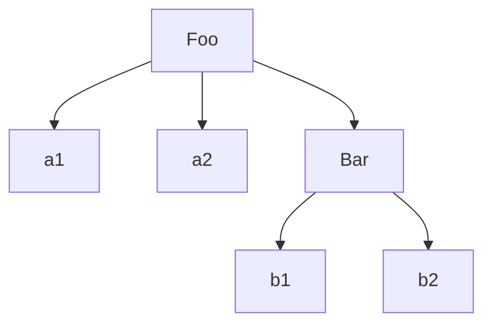

## this 和对象原型

[TOC]

### 1.关于 this

`this` 关键字是 JavaScript 中最复杂的机制之一。它是一个很特别的关键字，被自动定义在所有函数的作用域中。

#### 1.1.为什么要用 this

```js
function identify() {
  return this.name.toUpperCase();
}

function speak() {
  var greeting = "Hello, I'm " + identify.call(this);
  console.log(greeting);
}

var me = {
  name: "Kyle"
};

var you = {
  name: "Reader"
};

identify.call(me); // KYLE
identify.call(you); // READER

speak.call(me); // Hello, I'm KYLE
speak.call(you); // Hello, I'm READER
```

如果不使用 `this` ，那就需要给 `identify()` 和 `speak()` 显式传入一个上下文对象。

```js
function identify(context) {
  return context.name.toUpperCase();
}

function speak(context) {
  var greeting = "Hello, I'm " + identify(context);
  console.log(greeting);
}

identify(you); // READER
speak(me); //Hello, I'm KYLE
```

然而，`this` 提供了一种更优雅的方式来隐式“传递”一个对象引用，因此可以将 API 设计得更加简洁并且易于复用。

随着你的使用模式越来越复杂，显式传递上下文对象会让代码变得越来越混乱，使用 `this` 则不会这样。当我们介绍对象和原型时，你就会明白函数可以自动引用合适的上下文对象有多重要。

#### 1.2.误解

太拘泥于“this”的字面意思就会产生一些误解。有两种常见的对于 `this` 的解释，但是它们都是错误的。

##### 1.2.1.指向自身

人们很容易把 `this` 理解成指向函数自身，这个推断从英语的语法角度来说是说得通的。

```js
function foo(num) {
  console.log("foo: " + num);

  // 记录foo被调用的次数
  this.count++;
}

foo.count = 0;

var i;

for (i = 0; i < 10; i++) {
  if (i > 5) {
    foo(i);
  }
}
// foo: 6
// foo: 7
// foo: 8
// foo: 9

// foo被调用了多少次？
console.log(foo.count); // 0 -- 什么？！
```

显然从字面意思来理解 `this` 是错误的。如果要从函数对象内部引用它自身，那只使用 `this` 是不够的。一般来说你需要通过一个指向函数对象的词法标识符（变量）来引用它。

##### 1.2.2.函数作用域

第二种常见的误解是，`this` 指向函数的作用域。这个问题有点复杂，因为在某种情况下它是正确的，但是在其他情况下它却是错误的。

需要明确的是，`this` 在任何情况下都不指向函数的词法作用域。在 JavaScript 内部，作用域确实和对象类似，可见的标识符都是它的属性。但是作用域“对象”无法通过 JavaScript 代码访问，它存在于【JavaScript 引擎】内部。

> 每当你想要把 `this` 和词法作用域的查找混合使用时，一定要提醒自己，这是无法实现的（使用 `this` 不可能在词法作用域中查到什么。）。

#### 1.3.this 到底是什么

`this` 是在运行时进行绑定的，并不是在编写时绑定，它的上下文取决于函数调用时的各种条件。`this` 的绑定和函数声明的位置没有任何关系，只取决于函数的调用方式。

当一个函数被调用时，会创建一个活动记录（有时候也称为 **执行上下文**）。这个记录会包含函数在哪里被调用（调用栈）、函数的调用方式、传入的参数等信息。`this` 就是这个记录的一个属性，会在函数执行的过程中用到。

### 2.this 全面解析

#### 2.1.调用位置

在理解 `this` 的绑定过程之前，首先要理解调用位置：调用位置就是函数在代码中被调用的位置（而不是声明的位置）。只有仔细分析调用位置才能回答这个问题：这个 `this` 到底引用的是什么？

最重要的是要分析 **调用栈**（就是为了到达当前执行位置所调用的所有函数）。我们关心的 **调用位置就在当前正在执行的函数的前一个调用中**。

```js
function baz() {
  // 当前调用栈是：baz
  // 因此，当前调用位置是全局作用域

  console.log("baz");
  bar(); // <-- bar 的调用位置
}

function bar() {
  // 当前调用栈是：baz -> bar
  // 因此，当前调用位置在 baz 中

  console.log("bar");
  foo(); // <-- foo 的调用位置
}

function foo() {
  // 当前调用栈是：baz -> bar -> foo
  // 因此，当前调用位置在 bar 中

  console.log("foo");
}

baz(); // <-- baz 的调用位置
```

#### 2.2.绑定规则

我们来看看在函数的执行过程中调用位置如何决定this的绑定对象。

##### 2.2.1.默认绑定

首先要介绍的是最常用的函数调用类型：独立函数调用。直接使用不带任何修饰的函数引用进行调用的，因此只能使用默认绑定，无法应用其他规则。也可以把这条规则看作是无法应用其他规则时的默认规则。

默认绑定时，`this` 指向全局对象（严格模式下，不能将全局对象用于默认绑定，因此 `this` 会绑定到 `undefined`）。

```js
function foo() {
  console.log(this.a);
}

function bar() {
  'use strict';
  console.log(this.a);
}

var a = 2;

foo(); // 2
bar(); // TypeError
```

##### 2.2.2.隐式绑定

当函数引用有上下文对象时，隐式绑定规则会把函数调用中的 `this` 绑定到这个上下文对象。

```js
function foo() {
  console.log( this.a );
}

var obj = {
  a: 2,
  foo: foo,
  bar: function () {
    console.log( this.a );
  }
};

obj.foo(); // 2
obj.bar(); // 2
```

但对象属性引用链中只有上一层或者说最后一层在调用位置中起作用。

```js
function foo() {
  console.log( this.a );
}

var obj2 = {
  a: 42,
  foo: foo
};

var obj1 = {
  a: 2,
  obj2: obj2
};

obj1.obj2.foo(); // 42
```

- **隐式丢失**

一个最常见的 `this` 绑定问题就是被隐式绑定的函数会丢失绑定对象，也就是说它会应用默认绑定。

```js
function foo() {
  console.log(this.a);
}

var obj = {
  a: 2,
  foo: foo
};

var bar = obj.foo; // 函数别名！虽然 bar 是 obj.foo 的一个引用，但是实际上，它引用的是 foo 函数本身

var a = "oops, global"; // a是全局对象的属性

bar(); // "oops, global"
```

一种更微妙、更常见并且更出乎意料的情况发生在传入回调函数时：

```js
function foo() {
  console.log(this.a);
}

function doFoo(fn) {
  // fn其实引用的是foo

  fn(); // <-- 调用位置！
}

var obj = {
  a: 2,
  foo: foo
};

var a = "oops, global"; // a是全局对象的属性

doFoo(obj.foo); // "oops, global"
```

> 参数传递其实就是一种隐式赋值，因此我们传入函数时也会被隐式赋值。

如果把函数传入语言内置的函数而不是传入你自己声明的函数，结果是一样的，没有区别。

除此之外，还有一种情况 `this` 的行为会出乎我们意料：调用回调函数的函数可能会修改 `this`。在一些流行的 JavaScript 库中事件处理器常会把回调函数的 `this` 强制绑定到触发事件的 DOM 元素上。这在一些情况下可能很有用，但是有时它可能会让你感到非常郁闷。

无论是哪种情况，`this` 的改变都是意想不到的，实际上你无法控制回调函数的执行方式，因此就没有办法控制调用位置以得到期望的绑定。

##### 2.2.3.显式绑定

在分析隐式绑定时，我们必须在一个对象内部包含一个指向函数的属性，并通过这个属性间接引用函数，从而把 `this` 间接（隐式）绑定到这个对象上。

那么如果我们不想在对象内部包含函数引用，而想在某个对象上强制调用函数，该怎么做呢？

JavaScript 中的“所有”函数都有一些有用的特性（这和它们的 `[[Prototype]]` 有关），可以用来解决这个问题。具体点说，可以使用函数的 `call(..)` 和 `apply(..)` 方法。严格来说，JavaScript 的宿主环境有时会提供一些非常特殊的函数，它们并没有这两个方法。但是这样的函数非常罕见，JavaScript 提供的绝大多数函数以及自定义的所有函数都可以使用 `call(..)` 和 `apply(..)` 方法。

这两个方法是如何工作的呢？它们的第一个参数是一个对象，是给 `this` 准备的，接着在调用函数时将其绑定到 `this`。因为你可以直接指定 `this` 的绑定对象，因此我们称之为**显式绑定**。

```js
function foo() {
  console.log(this.a);
}

var obj = {
  a: 2
};

foo.call(obj); // 2
```

如果你传入了一个原始值（字符串类型、布尔类型或者数字类型）来当作 `this` 的绑定对象，这个原始值会被转换成它的对象形式（也就是 `new String(..)`、`new Boolean(..)` 或者 `new Number(..)`）。这通常被称为“包装”。

可惜，显式绑定仍然无法解决我们之前提出的丢失绑定问题。

- **硬绑定**

但是显式绑定的一个变种可以解决这个问题。

```js
function foo() {
  console.log(this.a);
}

var obj = {
  a: 2
};

var bar = function () {
  foo.call(obj);
};

bar(); // 2
setTimeout(bar, 100); // 2

// 硬绑定的 bar 不可能再修改它的 this
bar.call(window); // 2
```

无论之后如何调用函数 `bar`，它总会手动在 `obj` 上调用 `foo`。这种绑定是一种显式的强制绑定，因此我们称之为**硬绑定**。

硬绑定的典型应用场景就是创建一个【包裹函数】，负责接收参数并返回值：

```js
function foo(something) {
  console.log(this.a, something);
  return this.a + something;
}

var obj = {
  a: 2
};

var bar = function () {
  return foo.apply(obj, arguments);
};

var b = bar(3); // 2 3
console.log(b); // 5
```

另一种使用方法是创建一个可以重复使用的辅助函数：

```js
function foo(something) {
  console.log(this.a, something);
  return this.a + something;
}

// 简单的辅助绑定函数
function Bind(fn, obj) {
  return function () {
    return fn.apply(obj, arguments);
  };
}

var obj = {
  a: 2
};

var bar = Bind(foo, obj);

var b = bar(3); // 2 3
console.log(b); // 5
```

由于硬绑定是一种非常常用的模式，所以 ES5 提供了内置的方法 `Function.prototype.bind`。`bind(..)` 会返回一个硬绑定的新函数，它会把你指定的参数设置为 `this` 的上下文并调用原始函数。

- **API调用的“上下文”**

第三方库的许多函数，以及 JavaScript 语言和宿主环境中许多新的内置函数，都提供了一个可选的参数，通常被称为“上下文”（context），其作用和 `bind(..)` 一样，确保你的回调函数使用指定的 `this`。

```js
function foo(el) {
  console.log( el, this.id );
}

var obj = {
  id: "awesome"
};

// 调用 foo(..) 时把 this 绑定到 obj
[1, 2, 3].forEach( foo, obj );
// 1 awesome 2 awesome 3 awesome
```

##### 2.2.4.new 绑定

在传统的面向类的语言中，“构造函数”是类中的一些特殊方法，使用 `new` 初始化类时会（自动）调用类中的构造函数。通常的形式是这样的：

```js
something = new MyClass(..);
```

JavaScript 也有一个 `new` 操作符，使用方法看起来也和那些面向类的语言一样，绝大多数开发者都认为 JavaScript 中 `new` 的机制也和那些语言一样。然而，JavaScript 中 `new` 的机制实际上和面向类的语言完全不同。

首先我们重新定义一下 JavaScript 中的“构造函数”。JavaScript 中的构造函数只是一些使用 `new` 操作符时被调用的函数，它们并不会属于某个类，也不会实例化一个类。实际上，它们甚至都不能说是一种特殊的函数类型，它们只是被 `new` 操作符调用的普通函数而已。

举例来说，思考一下 `Number(..)` 作为构造函数时的行为，ES5.1 中这样描述它：

> 15.7.2 Number 构造函数
>
> 当 Number 在 `new` 表达式中被调用时，它是一个构造函数：它会初始化新创建的对象。

所以，包括内置对象函数（比如 `Number(..)`）在内的所有函数都可以用 `new` 来调用，这种函数调用被称为 **构造函数调用**。这里有一个重要但是非常细微的区别：实际上并不存在所谓的“构造函数”，只有对于函数的“**构造调用**”。

使用 `new` 来调用函数，或者说发生“构造调用”时，会自动执行下面的操作。

1. 创建（或者说构造）一个全新的对象。

2. 这个新对象会被执行 `[[Prototype]]` 连接。

3. 这个新对象会绑定到函数调用的 `this`。

4. 如果函数没有返回其他对象，那么 `new` 表达式中的函数调用会自动返回这个新对象。

```js
function foo(a) {
 this.a = a;
}

var bar = new foo(2);

console.log( bar.a ); // 2
```

使用 `new` 来调用 `foo(..)` 时，我们会构造一个新对象并把它绑定到 `foo(..)` 调用中的 `this` 上。`new` 是最后一种可以影响函数调用时 `this` 绑定行为的方法，我们称之为 **`new` 绑定**。

#### 2.3.优先级

毫无疑问，默认绑定的优先级是四条规则中最低的，所以我们可以先不考虑它。

```js
function foo() {
  console.log(this.a);
}

var obj1 = {
  a: 2,
  foo: foo
};

var obj2 = {
  a: 3,
  foo: foo
};

obj1.foo(); // 2
obj2.foo(); // 3

obj1.foo.call(obj2); // 3
obj2.foo.call(obj1); // 2
```

可以看到，显式绑定优先级更高，也就是说在判断时应当先考虑是否可以存在显式绑定。

```js
function foo(something) {
  this.a = something;
}

var obj1 = {
  foo: foo
};

var obj2 = {};

obj1.foo(2);
console.log(obj1.a); // 2

obj1.foo.call(obj2, 3);
console.log(obj2.a); // 3

var bar = new obj1.foo(4);
console.log(obj1.a); // 2
console.log(bar.a); // 4
```

可以看到 `new` 绑定比隐式绑定优先级高。

> `new` 和 `call/apply` 无法一起使用，使用了 `call/apply` 之后的函数不是函数，不是函数就不能使用 `new`。

实际上，ES5 中内置的 `Function.prototype.bind(..)` 更加复杂。下面是 MDN 提供的一种 `bind(..)` 实现：

```js
//  Yes, it does work with `new (funcA.bind(thisArg, args))`
if (!Function.prototype.bind) (function(){
  var ArrayPrototypeSlice = Array.prototype.slice;
  Function.prototype.bind = function(otherThis) {
    if (typeof this !== 'function') {
      // closest thing possible to the ECMAScript 5
      // internal IsCallable function
      throw new TypeError('Function.prototype.bind - what is trying to be bound is not callable');
    }

    var baseArgs= ArrayPrototypeSlice.call(arguments, 1),
        baseArgsLength = baseArgs.length,
        fToBind = this,
        fNOP    = function() {},
        fBound  = function() {
          baseArgs.length = baseArgsLength; // reset to default base arguments
          baseArgs.push.apply(baseArgs, arguments);
          return fToBind.apply(fNOP.prototype.isPrototypeOf(this) ? this : otherThis, baseArgs);
        };

    if (this.prototype) {
      // Function.prototype doesn't have a prototype property
      fNOP.prototype = this.prototype;
    }
    fBound.prototype = new fNOP();

    return fBound;
  };
})();
```

> 这种 `bind(..)` 是一种 polyfill 代码（polyfill 就是我们常说的刮墙用的腻子，polyfill 代码主要用于旧浏览器的兼容，比如说在旧的浏览器中并没有内置 `bind` 函数，因此可以使用 polyfill 代码在旧浏览器中实现新的功能），对于 `new` 使用的硬绑定函数来说，这段 polyfill 代码和 ES5 内置的 `bind(..)` 函数并不完全相同。由于 polyfill 并不是内置函数，所以无法创建一个不包含 `.prototype` 的函数，因此会具有一些副作用。如果你要在 `new` 中使用硬绑定函数并且依赖 polyfill 代码的话，一定要非常小心。

下面是 `new` 修改 `this` 的相关代码：

```js
fNOP.prototype.isPrototypeOf(this) ? this : otherThis
// ...
fNOP.prototype = this.prototype;
// ...
fBound.prototype = new fNOP();
```

简单来说，这段代码会判断硬绑定函数是否是被 `new` 调用，如果是的话就会使用新创建的 `this` 替换硬绑定的 `this`。

那么，为什么要在 `new` 中使用硬绑定函数呢？直接使用普通函数不是更简单吗？

之所以要在 `new` 中使用硬绑定函数，主要目的是预先设置函数的一些参数，这样在使用 `new` 进行初始化时就可以只传入其余的参数。`bind(..)` 的功能之一就是可以把除了第一个参数（第一个参数用于绑定 `this`）之外的其他参数都传给下层的函数（这种技术称为“部分应用”，是“柯里化”的一种）。

```js
function foo(p1,p2) {
  this.val = p1 + p2;
}

// 之所以使用null是因为在本例中我们并不关心硬绑定的this是什么
// 反正使用new时this会被修改
var bar = foo.bind( null, "p1" );

var baz = new bar( "p2" );

baz.val; // p1p2
```

小结：

---

- 函数是否在 `new` 中调用（`new` 绑定）？
  >
  - 是：`this` 绑定的是新创建的对象;
  - 否：函数是否通过 `call`、`apply`（显式绑定）或者硬绑定调用？
    >
    - 是：`this` 绑定的是指定的对象；
    - 否：函数是否在某个上下文对象中调用（隐式绑定）？
      >
      - 是：`this` 绑定的是那个上下文对象；
      - 否：使用默认绑定。如果在严格模式下，就绑定到 `undefined`，否则绑定到全局对象。

---

#### 2.4.绑定例外

在某些场景下 `this` 的绑定行为会出乎意料，你认为应当应用其他绑定规则时，实际上应用的可能是默认绑定规则。

##### 2.4.1.被忽略的 this

如果你把 `null` 或者 `undefined` 作为 `this` 的绑定对象传入 `call`、`apply` 或者 `bind`，这些值在调用时会被忽略，实际应用的是默认绑定规则：

```js
function foo() {
  console.log( this.a );
}

var a = 2;

foo.call( null ); // 2
```

那么什么情况下你会传入 `null` 呢？

一种非常常见的做法是使用 `apply(..)` 来“展开”一个数组，并当作参数传入一个函数。类似地，`bind(..)` 可以对参数进行柯里化（预先设置一些参数），这种方法有时非常有用：

```js
function foo(a,b) {
  console.log( "a:" + a + ", b:" + b );
}

// 把数组“展开”成参数
foo.apply( null, [2, 3] ); // a:2, b:3

// 使用 bind 进行柯里化
var bar = foo.bind( null, 2 );
bar( 3 ); // a:2, b:3
```

这些方法都需要传入一个参数当作 `this` 的绑定对象。如果函数并不关心 `this` 的话，你仍然需要传入一个占位值，这时 `null` 可能是一个不错的选择。

> 在ES6中，可以用 `...` 操作符代替 `apply(..)` 来“展开”数组，这样可以避免不必要的 `this` 绑定。可惜，在 ES6 中没有柯里化的相关语法，因此还是需要使用 `bind(..)`。

然而，总是使用 `null` 来忽略 `this` 绑定可能产生一些副作用。如果某个函数确实使用了 `this`（比如第三方库中的一个函数），那默认绑定规则会把 `this` 绑定到全局对象（在浏览器中这个对象是 window），这将导致不可预计的后果（比如修改全局对象）。显而易见，这种方式可能会导致许多难以分析和追踪的 bug。

- **更安全的this**

一种“更安全”的做法是传入一个特殊的对象，比如可以创建一个“DMZ”（demilitarized zone，非军事区）对象——它就是一个空的非委托的对象。

如果我们在忽略 `this` 绑定时总是传入一个 DMZ 对象，那就什么都不用担心了，因为任何对于 `this` 的使用都会被限制在这个空对象中，不会对全局对象产生任何影响。

无论你叫它什么，在 JavaScript 中创建一个空对象最简单的方法都是 `Object.create(null)`。`Object.create(null)` 和 `{}` 很像，但是并不会创建 `Object.prototype` 这个委托，所以它比 `{}` “更空”。

##### 2.4.2.间接引用

可能（有意或者无意地）创建一个函数的“间接引用”，在这种情况下，调用这个函数会应用默认绑定规则。

间接引用最容易在赋值时发生：

```js
function foo() {
  console.log( this.a );
}

var a = 2;
var o = { a: 3, foo: foo };
var p = { a: 4 };

o.foo(); // 3
(p.foo = o.foo)(); // 2
```

> 注意：对于默认绑定来说，决定 `this` 绑定对象的并不是调用位置是否处于严格模式，而是函数体是否处于严格模式。如果函数体处于严格模式，`this` 会被绑定到 `undefined`，否则 `this` 会被绑定到全局对象。

##### 2.4.3.软绑定

硬绑定这种方式可以把 `this` 强制绑定到指定的对象（除了使用 `new` 时），防止函数调用应用默认绑定规则。问题在于，硬绑定会大大降低函数的灵活性，使用硬绑定之后就无法使用隐式绑定或者显式绑定来修改 `this`。

如果可以给默认绑定指定一个全局对象和 `undefined` 以外的值，那就可以实现和硬绑定相同的效果，同时保留隐式绑定或者显式绑定修改 `this` 的能力，这种方式被称为 **软绑定**。

```js
if (!Function.prototype.softBind) {
  Function.prototype.softBind = function(obj) {
      var fn = this;
      // 捕获所有 curried 参数
      var curried = [].slice.call( arguments, 1 );
      var bound = function() {
          return fn.apply(
              (!this || this === (window || global)) ?obj : this,
              curried.concat.apply( curried, arguments )
          );
      };
      bound.prototype = Object.create( fn.prototype );
      return bound;
  };
}

// TODO: curried.concat.apply( curried, arguments );
// arguments 去掉好像也没有什么影响

// TODO: bound.prototype = Object.create( fn.prototype );
// 整句移除，也好像没什么影响
```

#### 2.5.箭头函数

箭头函数并不是使用 `function` 关键字定义的，而是使用被称为“胖箭头”的操作符 `=>` 定义的。箭头函数不使用 `this` 的四种标准规则，而是根据外层（函数或者全局）作用域来决定 `this`。具体来说，箭头函数会继承外层函数调用的 `this` 绑定（无论 `this` 绑定到什么）。

```js
function foo() {
  // 返回一个箭头函数
  return (a) => {
      //this继承自foo()
      console.log( this.a );
  };
}

var obj1 = {
  a:2
};

var obj2 = {
  a:3
};

var bar = foo.call( obj1 );
bar.call( obj2 ); // 2, 不是3！
```

箭头函数可以像 `bind(..)` 一样确保函数的 `this` 被绑定到指定对象，此外，其重要性还体现在它用更常见的词法作用域取代了传统的 `this` 机制。实际上，在 ES6 之前我们就已经在使用一种几乎和箭头函数完全一样的模式。

```js
function foo() {
  var self = this; // lexical capture of this
  setTimeout( function(){
      console.log( self.a );
  }, 100 );
}

var obj = {
  a: 2
};

foo.call( obj ); // 2
```

虽然 `self = this` 和箭头函数看起来都可以取代 `bind(..)`，但是从本质上来说，它们想替代的是 `this` 机制。

如果你经常编写 `this` 风格的代码，但是绝大部分时候都会使用 `self = this` 或者箭头函数来否定 `this` 机制，那你或许应当：

1. 只使用词法作用域并完全抛弃错误 `this` 风格的代码；
2. 完全采用 `this` 风格，在必要时使用 `bind(..)`，尽量避免使用 `self = this` 和箭头函数。

当然，包含这两种代码风格的程序可以正常运行，但是在同一个函数或者同一个程序中混合使用这两种风格通常会使代码更难维护，并且可能也会更难编写。

### 3.对象

#### 3.1.类型

`null` 有时会被当作一种对象类型，但是这其实只是语言本身的一个 bug，即对 `null` 执行 `typeof null` 时会返回字符串"object"。实际上，`null` 本身是基本类型。

> 原理是这样的，不同的对象在底层都表示为二进制，在 JavaScript 中二进制前三位都为 0 的话会被判断为 `object` 类型， `null` 的二进制表示是全 0，自然前三位也是 0，所以执行 typeof 时会返回“object”。

有一种常见的错误说法是“JavaScript 中万物皆是对象”，这显然是错误的。

实际上，JavaScript 中有许多特殊的对象子类型，我们可以称之为复杂基本类型。

函数就是对象的一个子类型（从技术角度来说就是“可调用的对象”）。JavaScript 中的函数是“一等公民”，因为它们本质上和普通的对象一样（只是可以调用），所以可以像操作其他对象一样操作函数（比如当作另一个函数的参数）。

数组也是对象的一种类型，具备一些额外的行为。数组中内容的组织方式比一般的对象要稍微复杂一些。

**内置对象**

JavaScript中还有一些对象子类型，通常被称为内置对象。有些内置对象的名字看起来和简单基础类型一样，不过实际上它们的关系更复杂。

- `String`
- `Number`
- `Boolean`
- `Object`
- `Function`
- `Array`
- `Date`
- `RegExp`
- `Error`

这些内置对象从表现形式来说很像其他语言中的类型（type）或者类（class），比如 Java 中的 `String` 类。

但是在 JavaScript 中，它们实际上只是一些内置函数。这些内置函数可以当作构造函数（由 `new` 产生的函数调用）来使用，从而可以构造一个对应子类型的新对象。

原始值"I am a string"并不是一个对象，它只是一个字面量，并且是一个不可变的值。如果要在这个字面量上执行一些操作，比如获取长度、访问其中某个字符等，那需要将其转换为 `String` 对象。

幸好，在必要时语言会自动把字符串字面量转换成一个 `String` 对象，也就是说你并不需要显式创建一个对象。JavaScript 社区中的大多数人都认为能使用文字形式时就不要使用构造形式。

> `null` 和 `undefined` 没有对应的构造形式，它们只有文字形式。相反，`Date` 只有构造，没有文字形式。

对于 `Objec`t、`Array`、`Function` 和 `RegExp`（正则表达式）来说，无论使用文字形式还是构造形式，它们都是对象，不是字面量。在某些情况下，相比用文字形式创建对象，构造形式可以提供一些额外选项。由于这两种形式都可以创建对象，所以我们首选更简单的文字形式。建议只在需要那些额外选项时使用构造形式。

`Error` 对象很少在代码中显式创建，一般是在抛出异常时被自动创建。也可以使用 `new Error(..)` 这种构造形式来创建，不过一般来说用不着。

#### 3.2.内容

对象的内容是由一些存储在特定命名位置的（任意类型的）值组成的，我们称之为**属性**。

需要强调的一点是，在引擎内部，这些值的存储方式是多种多样的，一般并不会存在对象容器内部。存储在对象容器内部的是这些属性的名称，它们就像指针（从技术角度来说就是引用）一样，指向这些值真正的存储位置。

```js
var myObject = {
  a: 2
};

myObject.a; // 2

myObject["a"]; // 2
```

如果要访问 `myObject` 中 `a` 位置上的值，我们需要使用 `.` 操作符或者 `[]` 操作符。`.a` 语法通常被称为“**属性访问**”，`["a"]` 语法通常被称为“**键访问**”。实际上它们访问的是同一个位置。

这两种语法的主要区别在于 `.` 操作符要求属性名满足标识符的命名规范，而 `[]` 语法可以接受任意 UTF-8/Unicode 字符串作为属性名。此外，由于 `[]` 语法使用字符串来访问属性，所以可以在程序中构造这个字符串。

在对象中，属性名永远都是字符串。如果你使用 `string`（字面量）以外的其他值作为属性名，那它首先会被转换为一个字符串。

##### 3.2.1.可计算属性名

如果需要通过表达式来计算属性名，那么 `[]` 这种属性访问语法就可以派上用场了。ES6 增加了可计算属性名，可以在文字形式中使用 `[]` 包裹一个表达式来当作属性名：

```js
var prefix = "foo";

var myObject = {
  [prefix + "bar"]: "hello",
  [prefix + "baz"]: "world"
};

myObject["foobar"]; // hello
myObject["foobaz"]; // world
```

可计算属性名最常用的场景可能是 ES6 的符号（Symbol），一般来说你不会用到符号的实际值（因为理论上来说在不同的 JavaScript 引擎中值是不同的），所以通常你接触到的是符号的名称：

```js
var myObject = {
  [Symbol('Something')]: "hello world"
}

console.log(myObject); // Symbol(Something): "hello world"
```

##### 3.2.2.属性与方法

由于函数很容易被认为是属于某个对象，在其他语言中，属于对象（也被称为“类”）的函数通常被称为“方法”，因此把“属性访问”说成是“方法访问”也就不奇怪了。有意思的是，JavaScript 的语法规范也做出了同样的区分。

从技术角度来说，函数永远不会“属于”一个对象，所以把对象内部引用的函数称为“方法”似乎有点不妥。确实，有些函数具有 `this` 引用，有时候这些 `this` 确实会指向调用位置的对象引用。但是这种用法从本质上来说并没有把一个函数变成一个“方法”，因为 `this` 是在运行时根据调用位置动态绑定的，所以函数和对象的关系最多也只能说是间接关系。

无论返回值是什么类型，每次访问对象的属性就是属性访问。如果属性访问返回的是一个函数，那它也并不是一个“方法”。属性访问返回的函数和其他函数没有任何区别（除了可能发生的隐式绑定this，就像我们刚才提到的）。

或许有人会辩解说，函数并不是在定义时成为方法，而是在被调用时根据调用位置的不同（是否具有上下文对象）成为方法。即便如此，这种说法仍然有些不妥。

最保险的说法可能是，“函数”和“方法”在 JavaScript 中是可以互换的。

> ES6 增加了 `super` 引用，一般来说会被用在 `class` 中。`super` 的行为似乎更有理由把 `super` 绑定的函数称为“方法”。但是再说一次，这些只是一些语义（和技术）上的微妙差别，本质是一样的。

##### 3.2.3.数组

数组也支持 `[]` 访问形式，数组有一套更加结构化的值存储机制（不过仍然不限制值的类型）。数组期望的是数值下标，也就是说值存储的位置（通常被称为索引）是非负整数。数组也是对象，所以虽然每个下标都是整数，你仍然可以给数组添加属性：

```js
var myArray = [ "foo", 42, "bar" ];

myArray.baz = "baz";
myArray.length; // 3

myArray['3'] = "bazz";
myArray.length; // 4

myArray.baz; // "baz"
myArray['3']; // "bazz"


```

可以看到虽然添加了命名属性（无论是通过 `.` 语法还是 `[]` 语法），数组的 `length` 值并未发生变化。

你完全可以把数组当作一个普通的键/值对象来使用，并且不添加任何数值索引，但是这并不是一个好主意。数组和普通的对象都根据其对应的行为和用途进行了优化，所以最好只用对象来存储键/值对，只用数组来存储数值下标/值对。

> 注意：如果你试图向数组添加一个属性，但是属性名“看起来”像一个数字，那它会变成一个数值下标（因此会修改数组的内容而不是添加一个属性）。

##### 3.2.4.复制对象

JavaScript 最常见的问题之一就是如何复制一个对象。看起来应该有一个内置的 `copy()` 方法，是吧？实际上事情更复杂，因为我们无法选择一个默认的复制算法。

```js
function anotherFunction() { /*..*/ }

var anotherObject = {
  c: true
};

var anotherArray = [];

var myObject = {
  a: 2,
  b: anotherObject, // 引用，不是复本！
  c: anotherArray, // 另一个引用！
  d: anotherFunction
};

anotherArray.push( anotherObject, myObject );
```

如何准确地表示 `myObject` 的复制呢？

首先，我们应该判断它是浅复制还是深复制。

对于浅拷贝来说，复制出的新对象中 `a` 的值会复制旧对象中 `a` 的值，也就是 2，但是新对象中 `b`、`c`、`d` 三个属性其实只是三个引用，它们和旧对象中 `b`、`c`、`d` 引用的对象是一样的。

对于深复制来说，除了复制 `myObject` 以外还会复制 `anotherObject` 和 `anotherArray`。这时问题就来了，`anotherArray` 引用了 `anotherObject` 和 `myObject`，所以又需要复制 `myObject`，这样就会由于循环引用导致死循环。

我们是应该检测循环引用并终止循环（不复制深层元素）？还是应当直接报错或者是选择其他方法？

除此之外，我们还不确定“复制”一个函数意味着什么。有些人会通过 `toString()` 来序列化一个函数的源代码（但是结果取决于 JavaScript 的具体实现，而且不同的引擎对于不同类型的函数处理方式并不完全相同）。

那么如何解决这些棘手问题呢？许多 JavaScript 框架都提出了自己的解决办法，但是 JavaScript 应当采用哪种方法作为标准呢？在很长一段时间里，这个问题都没有明确的答案。

对于 JSON 安全（也就是说可以被序列化为一个 JSON 字符串并且可以根据这个字符串解析出一个结构和值完全一样的对象）的对象来说，有一种巧妙的复制方法：

```js
var newObj = JSON.parse( JSON.stringify( someObj ) );
```

当然，这种方法需要保证对象是 `JSON` 安全的，所以只适用于部分情况。

相比深复制，浅复制非常易懂并且问题要少得多，所以 ES6 定义了 `Object.assign(..)` 方法来实现浅复制。

`Object.assign(..)` 方法的第一个参数是目标对象，之后还可以跟一个或多个源对象。它会遍历一个或多个源对象的所有可枚举（enumerable）的私有属性（owned key）并把它们复制（使用 `=` 操作符赋值）到目标对象，最后返回目标对象，就像这样：

```js
var newObj = Object.assign( {}, myObject );

newObj.a; // 2
newObj.b === anotherObject; // true
newObj.c === anotherArray; // true
newObj.d === anotherFunction; // true
```

> 但是需要注意的一点是，由于 `Object.assign(..)` 就是使用 `=` 操作符来赋值，所以源对象属性的一些特性（比如 `writable`）不会被复制到目标对象。

##### 3.2.5.属性描述符

在 ES5 之前，JavaScript 语言本身并没有提供可以直接检测属性特性的方法，比如判断属性是否是只读。但是从 ES5 开始，所有的属性都具备了属性描述符。

```js
var myObject = {
  a:2
};

// Object.getOwnPropertyDescriptor
Object.getOwnPropertyDescriptor( myObject, "a" );
// {
//    value: 2,
//    writable: true, // 可写
//    enumerable: true, // 可枚举
//    configurable: true // 可配置
// }
```

在创建普通属性时属性描述符会使用默认值，我们也可以使用 `Object.defineProperty(..)` 来添加一个新属性或者修改一个已有属性（如果它是 `configurable`）并对特性进行设置。

```js
var myObject = {};

Object.defineProperty( myObject, "a", {
  value: 2,
  writable: true,
  configurable: true,
  enumerable: true
} );

myObject.a; // 2
```

一般来说不会使用这种方式，除非需要修改属性描述符。

1.**Writable**

`writable` 决定是否可以修改属性的值。为 `false` 时，对于属性值的修改静默失败（silently failed）了。如果在严格模式下，这种方法会抛出 `TypeError` 错误。

> 简单来说，可以把 `writable:false` 看作是属性不可改变，相当于你定义了一个空操作 `setter`。严格来说，如果要和 `writable:false` 一致的话，你的 `setter` 被调用时应当抛出一个 `TypeError` 错误。

2.**Configurable**

只要属性是可配置的，就可以使用 `defineProperty(..)` 方法来修改属性描述符。

不管是不是处于严格模式，尝试修改一个不可配置的属性描述符都会产生一个 `TypeError` 错误。注意：如把 `configurable` 修改成 `false` 是单向操作，无法撤销！

> 要注意有一个小小的例外：即便属性是 `configurable:false`， 我们还是可以把 `writable` 的状态由 `true` 改为 `false`，但是无法由 `false` 改为 `true`。

除了无法修改，`configurable:false` 还会禁止删除这个属性。

> `delete` 只用来直接删除对象的（可删除）属性。如果对象的某个属性是某个对象/函数的最后一个引用者，对这个属性执行 `delete` 操作之后，这个未引用的对象/函数就可以被垃圾回收。但是，不要把 `delete` 看作一个释放内存的工具（就像 C/C++ 中那样），它就是一个删除对象属性的操作，仅此而已。

3.**Enumerable**

从名字就可以看出，这个描述符控制的是属性是否会出现在对象的属性枚举中，比如说 `for..in` 循环。如果把 `enumerable` 设置成 `false`，这个属性就不会出现在枚举中，虽然仍然可以正常访问它。相对地，设置成 `true` 就会让它出现在枚举中。

> 用户定义的所有的普通属性默认都是 `enumerable:true`。

##### 3.2.6.不变性

有时候希望属性或者对象是不可改变（无论有意还是无意）的，在 ES5 中可以通过很多种方法来实现。

很重要的一点是，所有的方法创建的都是【浅不变性】，也就是说，它们只会影响目标对象和它的直接属性。如果目标对象引用了其他对象（数组、对象、函数，等），其他对象的内容不受影响，仍然是可变的：

```js
myImmutableObject.foo; // [1,2,3]
myImmutableObject.foo.push( 4 );
myImmutableObject.foo; // [1,2,3,4]
```

> 在 JavaScript 程序中很少需要【深不可变性】。有些特殊情况可能需要这样做，但是根据通用的设计模式，如果你发现需要密封或者冻结所有的对象，那你或许应当退一步，重新思考一下程序的设计，让它能更好地应对对象值的改变。

1.**对象常量**

结合 `writable:false` 和 `configurable:false` 就可以创建一个真正的常量属性（不可修改、重定义或者删除）：

```js
var myObject = {};

Object.defineProperty( myObject, "FAVORITE_NUMBER", {
  value: 42,
  writable: false,
  configurable: false
} );
```

2.**禁止扩展**

如果一个对象可以添加新的属性，则这个对象是可扩展的。`Object.preventExtensions()` 将对象标记为不再可扩展，这样它将永远不会具有它被标记为不可扩展时持有的属性之外的属性。注意，一般来说，不可扩展对象的属性可能仍然可被删除。尝试将新属性添加到不可扩展对象将静默失败或抛出 `TypeError`（最常见的情况是 `strict mode` 中，但不排除其他情况）。

`Object.preventExtensions()` 仅阻止添加自身的属性。但其对象类型的原型依然可以添加新的属性。

该方法使得目标对象的 `[[prototype]]`  不可变；任何重新赋值 `[[prototype]]` 操作都会抛出 `TypeError`。这种行为只针对内部的 `[[prototype]]` 属性， 目标对象的其它属性将保持可变。

一旦将对象变为不可扩展的对象，就再也不能使其可扩展。

```js
// Object.preventExtensions 将原对象变的不可扩展,并且返回原对象.
var obj = {};
var obj2 = Object.preventExtensions(obj);
obj === obj2;  // true

// 字面量方式定义的对象默认是可扩展的.
var empty = {};
Object.isExtensible(empty) //=== true

// ...但可以改变.
Object.preventExtensions(empty);
Object.isExtensible(empty) //=== false

// 使用 Object.defineProperty 方法为一个不可扩展的对象添加新属性会抛出异常.
var nonExtensible = { removable: true };
Object.preventExtensions(nonExtensible);
Object.defineProperty(nonExtensible, "new", { value: 8675309 }); // TypeError

// 在严格模式中,为一个不可扩展对象的新属性赋值会抛出 TypeError 异常.
function fail()
{
  "use strict";
  nonExtensible.newProperty = "FAIL"; // TypeError
}
fail();

// 不可扩展对象的原型是不可变的
var fixed = Object.preventExtensions({});
// TypeError
fixed.__proto__ = { oh: 'hai' };
```

在 ES5 中，如果参数不是一个对象类型（而是原始类型），将抛出一个 `TypeError` 异常。在 ES2015 中，非对象参数将被视为一个不可扩展的普通对象，因此会被直接返回。

```js
Object.preventExtensions(1);
// TypeError: 1 is not an object (ES5 code)

Object.preventExtensions(1);
// 1                             (ES2015 code)
```

3.**密封**

通常，一个对象是可扩展的（可以添加新的属性）。密封一个对象会让这个对象变的不能添加新属性，且所有已有属性会变的不可配置。属性不可配置的效果就是属性变的不可删除，以及一个数据属性不能被重新定义成为访问器属性，或者反之。但属性的值仍然可以修改。尝试删除一个密封对象的属性或者将某个密封对象的属性从数据属性转换成访问器属性，结果会静默失败或抛出 `TypeError`（在严格模式 中最常见的，但不唯一）。

不会影响从原型链上继承的属性。但 `__proto__ ` 属性的值也会不能修改。

返回被密封对象的引用。

> `Object.seal()` 会创建一个“密封”的对象，这个方法实际上会在一个现有对象上调用 `Object.preventExtensions()` 并把所有现有属性标记为 `configurable:false`。

```js
var obj = {
  prop: function () { },
  foo: 'bar'
};

// 可以添加新的属性
// 可以更改或删除现有的属性
obj.foo = 'baz';
obj.lumpy = 'woof';
delete obj.prop;

var o = Object.seal(obj);

o === obj; // true
Object.isSealed(obj); // === true

// 仍然可以修改密封对象的属性值
obj.foo = 'quux';


// 但是你不能将属性重新定义成为访问器属性
// 反之亦然
Object.defineProperty(obj, 'foo', {
  get: function () { return 'g'; }
}); // TypeError

// 除了属性值以外的任何变化，都会失败.
obj.quaxxor = 'the friendly duck';
// 添加属性将会失败
delete obj.foo;
// 删除属性将会失败

// 在严格模式下，这样的尝试将会抛出错误
function fail() {
  'use strict';
  delete obj.foo; // TypeError
  obj.sparky = 'arf'; // TypeError
}
fail();

// 通过 Object.defineProperty 添加属性将会报错
Object.defineProperty(obj, 'ohai', {
  value: 17
}); // TypeError
Object.defineProperty(obj, 'foo', {
  value: 'eit'
}); // 通过 Object.defineProperty 修改属性值
```

在 ES5 中，如果这个方法的参数不是一个（原始）对象，那么它将导致 `TypeError`。在ES2015中，非对象参数将被视为已被密封的普通对象，会直接返回它。

```js
Object.seal(1);
// TypeError: 1 is not an object (ES5 code)

Object.seal(1);
// 1                             (ES2015 code)
```

> 使用 `Object.freeze()` 冻结的对象中的现有属性值是不可变的。用 `Object.seal()` 密封的对象可以改变其现有属性值。

4.**冻结**

`Object.freeze()` 方法可以冻结一个对象。一个被冻结的对象再也不能被修改；冻结了一个对象则不能向这个对象添加新的属性，不能删除已有属性，不能修改该对象已有属性的可枚举性、可配置性、可写性，以及不能修改已有属性的值。此外，冻结一个对象后该对象的原型也不能被修改。`freeze()` 返回和传入的参数相同的对象。

被冻结对象自身的所有属性都不可能以任何方式被修改。任何修改尝试都会失败，无论是静默地还是通过抛出 `TypeError` 异常（最常见但不仅限于 `strict mode`）。

数据属性的值不可更改，访问器属性（有 `getter` 和 `setter`）也同样（但由于是函数调用，给人的错觉是还是可以修改这个属性）。如果一个属性的值是个对象，则这个对象中的属性是可以修改的，除非它也是个冻结对象。数组作为一种对象，被冻结，其元素不能被修改。没有数组元素可以被添加或移除。

这个方法返回传递的对象，而不是创建一个被冻结的副本。

> `Object.freeze()` 会创建一个冻结对象，这个方法实际上会在一个现有对象上调用 `Object.seal()` 并把所有“数据访问”属性标记为 `writable:false`，这样就无法修改它们的值。

```js
var obj = {
  prop: function() {},
  foo: 'bar'
};

// 新的属性会被添加, 已存在的属性可能
// 会被修改或移除
obj.foo = 'baz';
obj.lumpy = 'woof';
delete obj.prop;

// 作为参数传递的对象与返回的对象都被冻结
// 所以不必保存返回的对象（因为两个对象全等）
var o = Object.freeze(obj);

o === obj; // true
Object.isFrozen(obj); // === true

// 现在任何改变都会失效
obj.foo = 'quux'; // 静默地不做任何事
// 静默地不添加此属性
obj.quaxxor = 'the friendly duck';

// 在严格模式，如此行为将抛出 TypeErrors
function fail(){
  'use strict';
  obj.foo = 'sparky'; // TypeError
  delete obj.quaxxor; // 返回 true，因为 quaxxor 属性从来未被添加
  obj.sparky = 'arf'; // TypeError
}

fail();

// 试图通过 Object.defineProperty 更改属性
// 下面两个语句都会抛出 TypeError.
Object.defineProperty(obj, 'ohai', { value: 17 });
Object.defineProperty(obj, 'foo', { value: 'eit' });

// 也不能更改原型
// 下面两个语句都会抛出 TypeError.
Object.setPrototypeOf(obj, { x: 20 })
obj.__proto__ = { x: 20 }
```

##### 3.2.7.`[[Get]]`

```js
var myObject = {
  a: 2
};

myObject.a; // 2
```

 `myObject.a` 是一次属性访问，但是这条语句并不仅仅是在 `myObjet` 中查找名字为a的属性，虽然看起来好像是这样。

在语言规范中，`myObject.a` 在 `myObject` 上实际上是实现了 `[[Get]]` 操作（有点像函数调用：`[[Get]]()）`。对象默认的内置 `[[Get]]` 操作首先在对象中查找是否有名称相同的属性，如果找到就会返回这个属性的值。

然而，如果没有找到名称相同的属性，按照 `[[Get]]` 算法的定义会执行另外一种非常重要的行为。

如果无论如何都没有找到名称相同的属性，那 `[[Get]]` 操作会返回值 `undefined`：

```js
var myObject = {
  a:2
};

myObject.b; // undefined
```

注意，这种方法和访问变量时是不一样的。如果你引用了一个当前词法作用域中不存在的变量，并不会像对象属性一样返回 `undefined`，而是会抛出一个 `ReferenceError` 异常：

```js
var myObject = {
  a: undefined
};

myObject.a; // undefined

myObject.b; // undefined
```

从返回值的角度来说，这两个引用没有区别——它们都返回了 `undefined`。然而，尽管乍看之下没什么区别，实际上底层的 `[[Get]]` 操作对 `myObject.b` 进行了更复杂的处理。

仅通过返回值，你无法判断一个属性是存在并且持有一个 `undefined` 值，还是变量不存在，所以 `[[Get]]` 无法返回某个特定值而返回默认的 `undefined`。

##### 3.2.8.`[[Put]]`

既然有可以获取属性值的 `[[Get]]` 操作，就一定有对应的 `[[Put]]` 操作。

你可能会认为给对象的属性赋值会触发 `[[Put]]` 来设置或者创建这个属性。但是实际情况并不完全是这样。

`[[Put]]` 被触发时，实际的行为取决于许多因素，包括对象中是否已经存在这个属性（这是最重要的因素）。

如果已经存在这个属性，`[[Put]]`算法大致会检查下面这些内容。

1. 属性是否是访问描述符？如果是并且存在 `setter` 就调用 `setter`。

2. 属性的数据描述符中`writable` 是否是 `false`？如果是，在非严格模式下静默失败，在严格模式下抛出 `TypeError` 异常。

3. 如果都不是，将该值设置为属性的值。

如果对象中不存在这个属性，`[[Put]]` 操作会更加复杂。

##### 3.2.9.Getter 和 Setter

对象默认的 `[[Put]]` 和 `[[Get]]` 操作分别可以控制属性值的设置和获取。

在 ES5 中可以使用 `getter` 和 `setter` 部分改写默认操作，但是只能应用在单个属性上，无法应用在整个对象上。`getter` 是一个隐藏函数，会在获取属性值时调用。`setter` 也是一个隐藏函数，会在设置属性值时调用。

当你给一个属性定义 `getter`、`setter` 或者两者都有时，这个属性会被定义为“**访问描述符**”（和“**数据描述符**”相对）。对于【访问描述符】来说，JavaScript 会忽略它们的 `value` 和 `writable` 特性，取而代之的是关心 `set` 和 `get`（还有 `configurable` 和 `enumerable`）特性。

```js
var myObject = {
  // 给 a 定义一个getter
  get a() {
    return 2;
  }
};

myObject.a = 3;

myObject.a; // 2
```

由于我们只定义了 `a` 的 `getter`，所以对 `a` 的值进行设置时 `set` 操作会忽略赋值操作，不会抛出错误。而且即便有合法的 `setter`，由于我们自定义的 `getter` 只会返回 2，所以 `set` 操作是没有意义的。

为了让属性更合理，还应当定义 `setter`，和你期望的一样，`setter` 会覆盖单个属性默认的 `[[Put]]`（也被称为赋值）操作。通常来说 `getter` 和 `setter` 是成对出现的（只定义一个的话通常会产生意料之外的行为）。

##### 3.2.10.存在性

`myObject.a` 的属性访问返回值可能是 `undefined`，但是这个值有可能是属性中存储的 `undefined`，也可能是因为属性不存在所以返回 `undefined`。那么如何区分这两种情况呢？

```js
var myObject = {
  a:2
};

("a" in myObject); // true
("b" in myObject); // false

myObject.hasOwnProperty( "a" ); // true
myObject.hasOwnProperty( "b" ); // false
```

`in` 操作符会检查属性是否在对象及其 `[[Prototype]]` 原型链中（参见第5章）。相比之下，`hasOwnProperty(..)` 只会检查属性是否在 `myObject` 对象中，不会检查 `[[Prototype]]` 链。

所有的普通对象都可以通过对于 `Object.prototype` 的委托来访问 `hasOwnProperty(..)`，但是有的对象可能没有连接到 `Object.prototype`（通过 `Object.create(null)`来创建）。在这种情况下，形如 `myObejct.hasOwnProperty(..)` 就会失败。

这时可以使用一种更加强硬的方法来进行判断：`Object.prototype.hasOwnProperty.call(myObject,"a")`，它借用基础的 `hasOwnProperty(..)` 方法并把它显式绑定到 `myObject` 上。

看起来 `in` 操作符可以检查容器内是否有某个值，但是它实际上检查的是某个属性名是否存在。对于数组来说这个区别非常重要，`4 in [2, 4, 6]` 的结果并不是你期待的 `True`，因为 `[2, 4, 6]` 这个数组中包含的属性名是 0、1、2，没有 4。

1.**枚举**

“可枚举”就相当于“可以出现在对象属性的遍历中”。

> 在数组上应用 `for..in` 循环有时会产生出人意料的结果，因为这种枚举不仅会包含所有数值索引，还会包含所有可枚举属性。最好只在对象上应用 `for..in` 循环，如果要遍历数组就使用传统的 `for` 循环来遍历数值索引。

```js
var myObject = { };

Object.defineProperty(
  myObject,
  "a",
  // 让a像普通属性一样可以枚举
  { enumerable: true, value: 2 }
);

Object.defineProperty(
  myObject,
  "b",
  // 让b不可枚举
  { enumerable: false, value: 3 }
);

myObject.b; // 3
("b" in myObject); // true
myObject.hasOwnProperty( "b" ); // true


for (var k in myObject) {
  console.log( k, myObject[k] );
}
// "a" 2
```

也可以通过另一种方式来区分属性是否可枚举：

```js
var myObject = { };

Object.defineProperty(
  myObject,
  "a",
  // 让a像普通属性一样可以枚举
  { enumerable: true, value: 2 }
);

Object.defineProperty(
  myObject,
  "b",
  // 让b不可枚举
  { enumerable: false, value: 3 }
);

myObject.propertyIsEnumerable( "a" ); // true
myObject.propertyIsEnumerable( "b" ); // false

Object.keys( myObject ); // ["a"]
Object.getOwnPropertyNames( myObject ); // ["a", "b"]
```

`propertyIsEnumerable(..)` 会检查给定的属性名是否直接存在于对象中（而不是在原型链上）并且满足 `enumerable:true`。

`Object.keys(..)` 会返回一个数组，包含所有可枚举属性，`Object.getOwnPropertyNames(..)`会返回一个数组，包含所有属性，无论它们是否可枚举。

`in` 和 `hasOwnProperty(..)` 的区别在于是否查找 `[[Prototype]]` 链，然而，`Object.keys(..)` 和 `Object.getOwnPropertyNames(..)` 都只会查找对象直接包含的属性。

（目前）并没有内置的方法可以获取 `in` 操作符使用的属性列表（对象本身的属性以及 `[[Prototype]]` 链中的所有属性）。不过你可以递归遍历某个对象的整条 `[[Prototype]]` 链并保存每一层中使用 `Object.keys(..)` 得到的属性列表——只包含可枚举属性。

#### 3.3.遍历

`for..in` 循环可以用来遍历对象的可枚举属性列表（包括 `[[Prototype]]` 链）。但是如何遍历属性的值呢？

对于数值索引的数组来说，可以使用标准的 `for` 循环来遍历值：

```js
var myArray = [1, 2, 3];

for (var i = 0; i < myArray.length; i++) {
 console.log( myArray[i] );
}
// 1 2 3
```

这实际上并不是在遍历值，而是遍历下标来指向值，如 `myArray[i]`。

ES5 中增加了一些数组的辅助迭代器，包括 `forEach(..)`、`every(..)` 和 `some(..)`。每种辅助迭代器都可以接受一个回调函数并把它应用到数组的每个元素上，唯一的区别就是它们对于回调函数返回值的处理方式不同。

> `forEach(..)` 会遍历数组中的所有值并忽略回调函数的返回值。`every(..)` 会一直运行直到回调函数返回 `false`（或者“假”值），`some(..)` 会一直运行直到回调函数返回true（或者“真”值）。`every(..)` 和 `some(..)` 中特殊的返回值和普通 `for` 循环中的 `break` 语句类似，它们会提前终止遍历。

使用 `for..in` 遍历对象是无法直接获取属性值的，因为它实际上遍历的是对象中的所有可枚举属性，你需要手动获取属性值。

> 遍历数组下标时采用的是数字顺序（`for` 循环或者其他迭代器），但是遍历对象属性时的顺序是不确定的，在不同的 JavaScript 引擎中可能不一样。因此，在不同的环境中需要保证一致性时，一定不要相信任何观察到的顺序，它们是不可靠的。

那么如何直接遍历值而不是数组下标（或者对象属性）呢？幸好，ES6 增加了一种用来遍历数组的 `for..of` 循环语法（如果对象本身定义了迭代器的话也可以遍历对象）：

```js
var myArray = [ 1, 2, 3 ];

for (var v of myArray) {
  console.log( v );
}
// 1
// 2
// 3
```

`for..of` 循环首先会向被访问对象请求一个迭代器对象，然后通过调用迭代器对象的 `next()` 方法来遍历所有返回值。

数组有内置的 `@@iterator`，因此 `for..of` 可以直接应用在数组上。我们使用内置的 `@@iterator` 来手动遍历数组，看看它是怎么工作的：

```js
var myArray = [ 1, 2, 3 ];
var it = myArray[Symbol.iterator]();

it.next(); // { value:1, done:false }
it.next(); // { value:2, done:false }
it.next(); // { value:3, done:false }
it.next(); // { done:true }
```

> 我们使用 ES6 中的符号 `Symbol.iterator` 来获取对象的 `@@iterator` 内部属性。之前我们简单介绍过符号，跟这里的原理是相同的。引用类似iterator的特殊属性时要使用符号名，而不是符号包含的值。此外，虽然看起来很像一个对象，但是 `@@iterator` 本身并不是一个迭代器对象，而是一个返回迭代器对象的函数——这点非常精妙并且非常重要。

和数组不同，普通的对象没有内置的 `@@iterator`，所以无法自动完成 `for..of` 遍历。之所以要这样做，有许多非常复杂的原因，不过简单来说，这样做是为了避免影响未来的对象类型。

### 4.混合对象“类”

#### 4.1.类理论

类/继承（class/inheritance） **描述了一种代码的组织结构形式**——一种在软件中对真实世界中问题领域的建模方法。

面向对象编程强调的是 **数据和操作数据的行为本质上是互相关联的**（当然，不同的数据有不同的行为），因此好的设计就是把数据以及和它相关的行为打包（或者说封装）起来。这在正式的计算机科学中有时被称为 **数据结构**。

举例来说，用来表示一个单词或者短语的一串字符通常被称为字符串。字符就是数据。但是你关心的往往不是数据是什么，而是可以对数据做什么，所以可以应用在这种数据上的行为（计算长度、添加数据、搜索，等等）都被设计成 `String` 类的方法。所有字符串都是 `String` 类的一个实例，也就是说它是一个包裹，包含字符数据和我们可以应用在数据上的函数。我们还可以使用类对数据结构进行分类，可以把任意数据结构看作范围更广的定义的一种特例。

我们来看一个常见的例子，“汽车”可以被看作“交通工具”的一种特例，后者是更广泛的类。我们可以在软件中定义一个 `Vehicle` 类和一个 `Car` 类来对这种关系进行建模。

`Vehicle` 的定义可能包含推进器（比如引擎）、载人能力等等，这些都是 `Vehicle` 的行为。我们在 `Vehicle` 中定义的是（几乎）所有类型的交通工具（飞机、火车和汽车）都包含的东西。

在我们的软件中，对不同的交通工具重复定义“载人能力”是没有意义的。相反，我们只在 `Vehicle` 中定义一次，定义 `Car` 时，只要声明它继承（或者扩展）了 `Vehicle` 的这个基础定义就行。`Car` 的定义就是对通用 `Vehicle` 定义的特殊化。

虽然 `Vehicle` 和 `Car` 会定义相同的方法，但是实例中的数据可能是不同的，比如每辆车独一无二的 VIN（Vehicle Identification Number，车辆识别号码），等等。

这就是类（class）、继承（inheritance）和实例化（instantiation）。

类的另一个核心概念是 **多态**（polymorphism），这个概念是说 **父类的通用行为可以被子类用更特殊的行为重写**。实际上，相对多态性允许我们从重写行为中引用基础行为。类理论强烈建议父类和子类使用相同的方法名来表示特定的行为，从而让子类重写父类。我们之后会看到，在 JavaScript 代码中这样做会降低代码的可读性和健壮性。

##### 4.1.1.“类”设计模式

你可能从来没把类作为设计模式来看待，讨论得最多的是面向对象设计模式，比如迭代器模式、观察者模式、工厂模式、单例模式，等等。从这个角度来说，我们似乎是在（低级）面向对象类的基础上实现了所有（高级）设计模式，似乎面向对象是优秀代码的基础。

如果你之前接受过正规的编程教育的话，可能听说过过程化编程，这种代码只包含过程（函数）调用，没有高层的抽象。或许老师还教过你最好使用类把过程化风格的“意大利面代码”转换成结构清晰、组织良好的代码。

当然，如果你有函数式编程（比如 Monad）的经验就会知道类也是非常常用的一种设计模式。但是对于其他人来说，这可能是第一次知道类并不是必须的编程基础，而是一种可选的代码抽象。

有些语言（比如 Java）并不会给你选择的机会，类并不是可选的——万物皆是类。其他语言（比如 C/C++ 或者 PHP）会提供过程化和面向类这两种语法，开发者可以选择其中一种风格或者混用两种风格。

##### 4.1.2.JavaScript 中的“类”

JavaScript 属于哪一类呢？在相当长的一段时间里，JavaScript 只有一些近似类的语法元素（比如 `new` 和 `instanceof`），不过在后来的 ES6 中新增了一些元素，比如 `class` 关键字。

这是不是意味着 JavaScript 中实际上有类呢？简单来说：不是。

由于**类是一种设计模式**，所以你可以用一些方法近似实现类的功能。为了满足对于类设计模式的最普遍需求，JavaScript 提供了一些近似类的语法。

虽然有近似类的语法，但是 JavaScript 的机制似乎一直在阻止你使用类设计模式。在近似类的表象之下，JavaScript 的机制其实和类完全不同。语法糖和（广泛使用的） JavaScript “类”库试图掩盖这个现实，但是你迟早会面对它：其他语言中的类和 JavaScript 中的“类”并不一样。

#### 4.2.类的机制

在许多面向类的语言中，“标准库”会提供 `Stack` 类，它是一种“栈”数据结构（支持压入、弹出，等等）。`Stack` 类内部会有一些变量来存储数据，同时会提供一些公有的可访问行为（“方法”），从而让你的代码可以和（隐藏的）数据进行交互（比如添加、删除数据）。

但是在这些语言中，你实际上并不是直接操作 `Stack`（除非创建一个静态类成员引用）。`Stack` 类仅仅是一个抽象的表示，它描述了所有“栈”需要做的事，但是它本身并不是一个“栈”。你必须先实例化 `Stack` 类然后才能对它进行操作。

##### 4.2.1.建造

“类”和“实例”的概念来源于房屋建造。

建筑师会规划出一个建筑的所有特性：多宽、多高、多少个窗户以及窗户的位置，甚至连建造墙和房顶需要的材料都要计划好。在这个阶段他并不需要关心建筑会被建在哪，也不需要关心会建造多少个这样的建筑。建筑师也不太关心建筑里的内容——家具、壁纸、吊扇等——他只关心需要用什么结构来容纳它们。

建筑蓝图只是建筑计划，它们并不是真正的建筑，我们还需要一个建筑工人来建造建筑。建筑工人会按照蓝图建造建筑。实际上，他会把规划好的特性从蓝图中复制到现实世界的建筑中。完成后，建筑就成为了蓝图的物理实例，本质上就是对蓝图的复制。之后建筑工人就可以到下一个地方，把所有工作都重复一遍，再创建一份副本。

建筑和蓝图之间的关系是间接的。你可以通过蓝图了解建筑的结构，只观察建筑本身是无法获得这些信息的。但是如果你想打开一扇门，那就必须接触真实的建筑才行——蓝图只能表示门应该在哪，但并不是真正的门。

一个类就是一张蓝图。为了获得真正可以交互的对象，我们必须按照类来建造（也可以说实例化）一个东西，这个东西通常被称为【实例】，有需要的话，我们可以直接在实例上调用方法并访问其所有公有数据属性。这个对象就是类中描述的所有特性的一份副本。

你走进一栋建筑时，它的蓝图不太可能挂在墙上（尽管这个蓝图可能会保存在公共档案馆中）。类似地，你通常也不会使用一个实例对象来直接访问并操作它的类，不过至少可以判断出这个实例对象来自哪个类。

把类和实例对象之间的关系看作是直接关系而不是间接关系通常更有助于理解。类通过复制操作被实例化为对象形式：



##### 4.2.2.构造函数

类实例是由一个特殊的类方法构造的，这个方法名通常和类名相同，被称为 **构造函数**。这个方法的任务就是初始化实例需要的所有信息（状态）。

```js
// 伪代码
class CoolGuy {
 specialTrick = nothing

 CoolGuy( trick ) {
  specialTrick = trick
 }

 showOff() {
  output( "Here's my trick: ", specialTrick )
 }
}
```

我们可以调用类构造函数来生成一个 `CoolGuy` 实例：

```js
Joe = new CoolGuy( "jumping rope" )

Joe.showOff() // Here's my trick: jumping rope
```

注意，`CoolGuy` 类有一个 `CoolGuy()` 构造函数，执行 `new CoolGuy()` 时实际上调用的就是它。构造函数会返回一个对象（也就是类的一个实例），之后我们可以在这个对象上调用 `showOff()` 方法，来输出指定 `CoolGuy` 的特长。

类构造函数属于类，而且通常和类同名。此外，构造函数大多需要用 `new` 来调，这样语言引擎才知道你想要构造一个新的类实例。

#### 4.3.类的继承

在面向类的语言中，你可以先定义一个类，然后定义一个继承前者的类。后者通常被称为“子类”，前者通常被称为“父类”。这些术语显然是类比父母和孩子，不过在意思上稍有扩展。

对于父母的亲生孩子来说，父母的基因特性会被复制给孩子。显然，在大多数生物的繁殖系统中，双亲都会贡献等量的基因给孩子。但是在编程语言中，我们假设只有一个父类。一旦孩子出生，他们就变成了单独的个体。虽然孩子会从父母继承许多特性，但是他是一个独一无二的存在。如果孩子的头发是红色，父母的头发未必是红的，也不会随之变红，二者之间没有直接的联系。

同理，定义好一个子类之后，相对于父类来说它就是一个独立并且完全不同的类。子类会包含父类行为的原始副本，但是也可以重写所有继承的行为甚至定义新行为。

非常重要的一点是，我们讨论的父类和子类并不是实例。父类和子类的比喻容易造成一些误解，实际上我们应当把父类和子类称为父类 DNA 和子类 DNA。我们需要根据这些 DNA 来创建（或者说实例化）一个人，然后才能和他进行沟通。

好了，我们先抛开现实中的父母和孩子，来看一个稍有不同的例子：不同类型的交通工具。这是一个非常典型的讲解继承的例子。

思考下面关于类继承的伪代码（为了方便理解并缩短代码，我们省略了这些类的构造函数）：

```js
class Vehicle {
    engines = 1

    ignition() {
        output( "Turning on my engine." )
    }

    drive() {
        ignition();
        output( "Steering and moving forward!" )
    }
}

class Car inherits Vehicle {
    wheels = 4

    drive() {
        inherited:drive()
        output( "Rolling on all ", wheels, " wheels!" )
    }
}

class SpeedBoat inherits Vehicle {
    engines = 2

    ignition() {
        output( "Turning on my ", engines, " engines." )
    }

    pilot() {
        inherited:drive()
        output( "Speeding through the water with ease!" )
    }
}
```

我们通过定义 `Vehicle` 类来假设一种发动机，一种点火方式，一种驾驶方法。但是你不可能制造一个通用的“交通工具”，因为这个类只是一个抽象的概念。接下来我们定义了两类具体的交通工具：`Car` 和 `SpeedBoat`。它们都从 `Vehicle` 继承了通用的特性并根据自身类别修改了某些特性。汽车需要四个轮子，快艇需要两个发动机，因此它必须启动两个发动机的点火装置。

##### 4.3.1.多态

`Car` 重写了继承自父类的 `drive()` 方法，但是之后 `Car` 调用了 `inherited:drive()` 方法，这表明 `Car` 可以引用继承来的原始 `drive()` 方法。快艇的 `pilot()` 方法同样引用了原始 `drive()` 方法。

这个技术（子类可以引用继承来的父类方法）被称为 **多态** 或者 **虚拟多态**。在本例中，更恰当的说法是 **相对多态**。

多态是一个非常广泛的话题，我们现在所说的“相对”只是多态的一个方面：**任何方法都可以引用继承层次中高层的方法（无论高层的方法名和当前方法名是否相同）**。之所以说“相对”是因为我们并不会定义想要访问的绝对继承层次（或者说类），而是使用相对引用“查找上一层”。

在许多语言中可以使用 `super` 来代替本例中的 `inherited:`，它的含义是“超类”（superclass），表示当前类的父类/祖先类。

多态的另一个方面是，**在继承链的不同层次中一个方法名可以被多次定义，当调用方法时会自动选择合适的定义**。

在之前的代码中就有两个这样的例子：`drive()` 被定义在 `Vehicle` 和 `Car` 中，`ignition()` 被定义在 `Vehicle` 和 `SpeedBoat` 中。

> 在传统的面向类的语言中 `super` 还有一个功能，就是从子类的构造函数中通过 `super` 可以直接调用父类的构造函数。通常来说这没什么问题，因为对于真正的类来说，构造函数是属于类的。然而，在 JS 中恰好相反——实际上“类”是属于构造函数的（类似 `Foo.prototype...` 这样的类型引用）。由于 JS 中父类和子类的关系只存在于两者构造函数对应的 `.prototype` 对象中，因此它们的构造函数之间并不存在直接联系，从而无法简单地实现两者的相对引用（在 ES6 的类中可以通过 `super` 来“解决”这个问题）。

我们可以在 `ignition()` 中看到多态非常有趣的一点。在 `pilot()` 中通过相对多态引用了（继承来的）`Vehicle` 中的 `drive()`。但是那个 `drive()` 方法直接通过名字（而不是相对引用）引用了 `ignotion()` 方法。

那么语言引擎会使用哪个 `ignition()` 呢，`Vehicle` 的还是 `SpeedBoat` 的？实际上它会使用 `SpeedBoat` 的 `ignition()`。如果你直接实例化了 `Vehicle` 类然后调用它的 `drive()`，那语言引擎就会使用 `Vehicle` 中的 `ignition()` 方法。

换言之，`ignition()` 方法定义的多态性取决于你是在哪个类的实例中引用它。

这似乎是一个过于深入的学术细节，但是只有理解了这个细节才能理解 JavaScript 中类似（但是并不相同）的 `[[Prototype]]` 机制。

在子类（而不是它们创建的实例对象！）中也可以相对引用它继承的父类，这种相对引用通常被称为 `super`。

需要注意，子类得到的仅仅是继承自父类行为的一份副本。子类对继承到的一个方法进行“重写”，不会影响父类中的方法，这两个方法互不影响，因此才能使用相对多态引用访问父类中的方法（如果重写会影响父类的方法，那重写之后父类中的原始方法就不存在了，自然也无法引用）。

多态并不表示子类和父类有关联，子类得到的只是父类的一份副本。**类的继承其实就是复制**。

##### 4.3.2.多重继承

还记得我们之前关于父类、子类和 DNA 的讨论吗？当时我们说这个比喻不太恰当，因为在现实中绝大多数后代是由双亲产生的。如果类可以继承两个类，那看起来就更符合现实的比喻了。

有些面向类的语言允许你继承多个“父类”。多重继承意味着所有父类的定义都会被复制到子类中。

从表面上来，对于类来说这似乎是一个非常有用的功能，可以把许多功能组合在一起。然而，这个机制同时也会带来很多复杂的问题。如果两个父类中都定义了 `drive()` 方法的话，子类引用的是哪个呢？难道每次都需要手动指定具体父类的 `drive()` 方法吗？这样多态继承的很多优点就不存在了。

除此之外，还有一种被称为钻石问题的变种。在钻石问题中，子类 `D` 继承自两个父类（ `B` 和 `C`），这两个父类都继承自 `A`。如果 `A` 中有 `drive()` 方法并且 `B` 和 `C` 都重写了这个方法（多态），那当 `D` 引用 `drive()` 时应当选择哪个版本呢（`B:drive()` 还是 `C:drive()`）？

这些问题远比看上去要复杂得多。之所以要介绍这些问题，主要是为了和 JavaScript 的机制进行对比。

相比之下，JavaScript 要简单得多：它本身并不提供“多重继承”功能。许多人认为这是件好事，因为使用多重继承的代价太高。然而这无法阻挡开发者们的热情，他们会尝试各种各样的办法来实现多重继承，我们马上就会看到。

#### 4.4.混入

**在继承或者实例化时，JavaScript 的对象机制并不会自动执行复制行为**。简单来说，JavaScript 中只有对象，并不存在可以被实例化的“类”。一个对象并不会被复制到其他对象，它们会被关联起来。

由于在其他语言中类表现出来的都是复制行为，因此 JavaScript 开发者也想出了一个方法来【模拟类的复制行为】，这个方法就是 **混入**。接下来我们会看到两种类型的混入：显式和隐式。

##### 4.4.1.显式混入

首先我们来回顾一下之前提到的 `Vehicle` 和 `Car`。由于 JavaScript 不会自动实现 `Vehicle` 到 `Car` 的复制行为，所以我们需要手动实现复制功能。这个功能在许多库和框架中被称为 `extend(..)`，但是为了方便理解我们称之为 `mixin(..)`。

```js
// 非常简单的mixin(..)例子:
function mixin( sourceObj, targetObj ) {
    for (var key in sourceObj) {
        // 只会在不存在的情况下复制
        if (!(key in targetObj)) {
            targetObj[key] = sourceObj[key];
        }
    }

    return targetObj;
}

var Vehicle = {
    engines: 1,

    ignition: function() {
        console.log( "Turning on my engine." );
    },

    drive: function() {
        this.ignition();
        console.log( "Steering and moving forward!" );
    }
};

var Car = mixin( Vehicle, {
    wheels: 4,

    drive: function() {
        Vehicle.drive.call( this );
        console.log(
           "Rolling on all " + this.wheels + " wheels!"
        );
    }
} );
```

> 有一点需要注意，我们处理的已经不再是类了，因为在 JavaScript 中不存在类，`Vehicle` 和 `Car` 都是对象，供我们分别进行复制和粘贴。

现在 `Car` 中就有了一份 `Vehicle` 属性和函数的副本了。从技术角度来说，函数实际上没有被复制，复制的是函数引用。所以， `Car` 中的属性 `ignition` 只是从 `Vehicle` 中复制过来的对于 `ignition()` 函数的引用。相反，属性 `engines` 就是直接从 `Vehicle` 中复制了值 1。

`Car` 已经有了 `drive` 属性（函数），所以这个属性引用并没有被 `mixin` 重写，从而保留了 `Car` 中定义的同名属性，实现了“子类”对“父类”属性的重写。

1.**再说多态**

我们来分析一下这条语句：`Vehicle.drive.call( this )`。这就是 **显式多态**。在之前的伪代码中对应的语句是  `inherited:drive()`，我们称之为 **相对多态**。

JavaScript（在 ES6 之前）并没有相对多态的机制。所以，由于 `Car` 和 `Vehicle` 中都有 `drive()` 函数，为了指明调用对象，我们必须使用绝对（而不是相对）引用。我们通过名称显式指定 `Vehicle` 对象并调用它的 `drive()` 函数。

> 如果函数 `Car.drive()` 的名称标识符并没有和 `Vehicle.drive()` 重叠的话，我们就不需要实现方法多态，因为调用 `mixin(..)` 时会把函数 `Vehicle.drive()` 的引用复制到 `Car` 中，因此我们可以直接访问 `this.drive()`。正是由于存在标识符重叠，所以必须使用更加复杂的显式伪多态方法。

在支持相对多态的面向类的语言中，`Car` 和 `Vehicle` 之间的联系只在类定义的开头被创建，从而只需要在这一个地方维护两个类的联系。

但是在 JavaScript中（由于屏蔽）使用显式伪多态会在所有需要使用（伪）多态引用的地方创建一个函数关联，这会极大地增加维护成本。此外，由于显式伪多态可以模拟多重继承，所以它会进一步增加代码的复杂度和维护难度。

使用伪多态通常会导致代码变得更加复杂、难以阅读并且难以维护，因此应当尽量避免使用显式伪多态，因为这样做往往得不偿失。

2.**混合复制**

```js
// 非常简单的mixin(..)例子:
function mixin( sourceObj, targetObj ) {
    for (var key in sourceObj) {
        // 只会在不存在的情况下复制
        if (!(key in targetObj)) {
            targetObj[key] = sourceObj[key];
        }
    }

    return targetObj;
}
```

现在我们来分析一下 `mixin(..)` 的工作原理。它会遍历 `sourceObj`（本例中是 `Vehicle`）的属性，如果在 `targetObj`（本例中是 `Car`）没有这个属性就会进行复制。由于我们是在目标对象初始化之后才进行复制，因此一定要小心不要覆盖目标对象的原有属性。

如果我们是先进行复制然后对 `Car` 进行特殊化的话，就可以跳过存在性检查。不过这种方法并不好用并且效率更低，所以不如第一种方法常用：

```js
// 另一种混入函数，可能有重写风险
function mixin( sourceObj, targetObj ) {
    for (var key in sourceObj) {
        targetObj[key] = sourceObj[key];
    }

    return targetObj;
}

var Vehicle = {
    // ...
};

// 首先创建一个空对象并把 Vehicle 的内容复制进去
var Car = mixin( Vehicle, { } );

// 然后把新内容复制到Car中
mixin( {
    wheels: 4,

    drive: function() {
        // ...
    }
}, Car );
```

这两种方法都可以把不重叠的内容从 `Vehicle` 中显性复制到 `Car` 中。“混入”这个名字来源于这个过程的另一种解释：`Car` 中混合了 `Vehicle` 的内容。复制操作完成后，`Car` 就和 `Vehicle` 分离了，向 `Car` 中添加属性不会影响 `Vehicle`，反之亦然。

> 这里跳过了一些小细节，实际上，在复制完成之后两者之间仍然有一些巧妙的方法可以“影响”到对方，例如引用同一个对象（比如一个数组）。

由于两个对象引用的是同一个函数，因此这种复制（或者说混入）实际上并不能完全模拟面向类的语言中的复制。

JavaScript 中的函数无法（用标准、可靠的方法）真正地复制，所以你只能复制对共享函数对象的引用。如果你修改了共享的函数对象（比如 `ignition()`），比如添加了一个属性，那 `Vehicle` 和 `Car` 都会受到影响。

显式混入是 JavaScript 中一个很棒的机制，不过它的功能也没有看起来那么强大。虽然它可以把一个对象的属性复制到另一个对象中，但是这其实并不能带来太多的好处，无非就是少几条定义语句，而且还会带来我们刚才提到的函数对象引用问题。

如果你向目标对象中显式混入超过一个对象，就可以部分模仿多重继承行为，但是仍没有直接的方式来处理函数和属性的同名问题。有些开发者/库提出了“晚绑定”技术和其他的一些解决方法，但是从根本上来说，使用这些“诡计”通常会（降低性能并且）得不偿失。

一定要注意，只在能够提高代码可读性的前提下使用显式混入，避免使用增加代码理解难度或者让对象关系更加复杂的模式。

如果使用混入时感觉越来越困难，那或许你应该停止使用它了。实际上，如果你必须使用一个复杂的库或者函数来实现这些细节，那就标志着你的方法是有问题的或者是不必要的。

3.**寄生继承**

显式混入模式的一种变体被称为“寄生继承”，它既是显式的又是隐式的，主要推广者是 Douglas Crockford。

```js
// “传统的 JS 类” Vehicle
function Vehicle() {
    this.engines = 1;
}
Vehicle.prototype.ignition = function() {
    console.log( "Turning on my engine." );
};
Vehicle.prototype.drive = function() {
    this.ignition();
    console.log( "Steering and moving forward!" );
};

// “寄生类” Car
function Car() {
    // 首先，car 是一个 Vehicle
    var car = new Vehicle();

    // 接着我们对 car 进行定制
    car.wheels = 4;

    // 保存到 Vehicle::drive() 的特殊引用
    var vehDrive = car.drive;

    // 重写 Vehicle::drive()
    car.drive = function() {
        vehDrive.call( this );
        console.log(
            "Rolling on all " + this.wheels + " wheels!"
        );
    }
    return car;
}

var myCar = new Car();

myCar.drive();
// Turning on my engine.
// Steering and moving forward!
// Rolling on all 4 wheels!
```

如你所见，首先我们复制一份 `Vehicle` 父类（对象）的定义，然后混入子类（对象）的定义（如果需要的话保留到父类的特殊引用），然后用这个复合对象构建实例。

> 调用 `new Car()` 时会创建一个新对象并绑定到 `Car` 的 `this` 上。但是因为我们没有使用这个对象而是返回了我们自己的 `car` 对象，所以最初被创建的这个对象会被丢弃，因此可以不使用 `new` 关键字调用 `Car()`。这样做得到的结果是一样的，但是可以避免创建并丢弃多余的对象。

##### 4.4.2.隐式混入

隐式混入和之前提到的显式伪多态很像，因此也具备同样的问题。

思考下面的代码：

```js
var Something = {
    cool: function() {
        this.greeting = "Hello World";
        this.count = this.count ? this.count + 1 : 1;
    }
};

Something.cool();
Something.greeting; // "Hello World"
Something.count; // 1

var Another = {
    cool: function() {
        // 隐式把Something混入Another
        Something.cool.call( this );
    }
};

Another.cool();
Another.greeting; // "Hello World"
Another.count; // 1 （count不是共享状态）
```

通过在构造函数调用或者方法调用中使用 `Something.cool.call( this )`，我们实际上“借用”了函数 `Something.cool()` 并在 `Another` 的上下文中调用了它（通过this绑定）。最终的结果是 `Something.cool()` 中的赋值操作都会应用在 `Another` 对象上而不是 `Something` 对象上。

因此，我们把 `Something` 的行为“混入”到了 `Another` 中。

虽然这类技术利用了 `this` 的重新绑定功能，但是 `Something.cool.call( this )` 仍然无法变成相对（而且更灵活的）引用，所以使用时千万要小心。通常来说，尽量避免使用这样的结构，以保证代码的整洁和可维护性。

### 5.原型

#### 5.1.`[[Prototype]]`

JavaScript 中的对象有一个特殊的 `[[Prototype]]` 内置属性，其实就是对于其他对象的引用。几乎所有的对象在创建时 `[[Prototype]]` 属性都会被赋予一个非空的值。

注意：很快我们就可以看到，对象的 `[[Prototype]]` 链接可以为空，虽然很少见。

思考下面的代码：

```js
var myObject = {
    a:2
};

myObject.a; // 2
```

`[[Prototype]]` 引用有什么用呢？当试图引用对象的属性时会触发 `[[Get]]` 操作，比如 `myObject.a`。对于默认的 `[[Get]]` 操作来说，第一步是检查对象本身是否有这个属性，如果有的话就使用它。

> 注意，如果包含 Proxy 的话，我们这里对 `[[Get]]` 和 `[[Put]]` 的讨论就不适用。

但是如果 `a` 不在 `myObject` 中，就需要使用对象的 `[[Prototype]]` 链了。

对于默认的 `[[Get]]` 操作来说，如果无法在对象本身找到需要的属性，就会继续访问对象的 `[[Prototype]]` 链：

```js
var anotherObject = {
    a:2
};

// 创建一个关联到 anotherObject 的对象
var myObject = Object.create( anotherObject );

myObject.a; // 2
```

现在 `myObject` 对象的 `[[Prototype]]` 关联到了 `anotherObject`。显然 `myObject.a` 并不存在，但是尽管如此，属性访问仍然成功地（在 `anotherObject` 中）找到了值 2。

但是，如果 `anotherObject` 中也找不到 `a` 并且 `[[Prototype]]` 链不为空的话，就会继续查找下去。这个过程会持续到找到匹配的属性名或者查找完整条 `[[Prototype]]` 链。如果是后者的话，`[[Get]]` 操作的返回值是 `undefined`。

使用 `for..in` 遍历对象时原理和查找 `[[Prototype]]` 链类似，任何可以通过原型链访问到（并且是 `enumerable`）的属性都会被枚举。使用 `in` 操作符来检查属性在对象中是否存在时，同样会查找对象的整条原型链（无论属性是否可枚举）：

```js
var anotherObject = {
    a:2
};

// 创建一个关联到anotherObject的对象
var myObject = Object.create( anotherObject );

for (var k in myObject) {
    console.log("found: " + k);
}
// found: a

("a" in myObject); // true
```

因此，当你通过各种语法进行属性查找时都会查找 `[[Prototype]]` 链，直到找到属性或者查找完整条原型链。

##### 5.1.1.Object.prototype

但是到哪里是 `[[Prototype]]` 的“尽头”呢？

所有普通的 `[[Prototype]]` 链最终都会指向内置的 `Object.prototype`。由于所有的“普通”（内置，不是特定主机的扩展）对象都“源于”（或者说把 `[[Prototype]]` 链的顶端设置为）这个 `Object.prototype` 对象，所以它包含 JavaScript 中许多通用的功能。

##### 5.1.2.属性设置和屏蔽

给一个对象设置属性并不仅仅是添加一个新属性或者修改已有的属性值：

```js
myObject.foo = "bar";
```

如果 `myObject` 对象中包含名为 `foo` 的普通数据访问属性，这条赋值语句只会修改已有的属性值。

如果 `foo` 不是直接存在于 `myObject` 中，`[[Prototype]]` 链就会被遍历，类似 `[[Get]]` 操作。如果原型链上找不到 `foo`，`foo` 就会被直接添加到 `myObject`上。然而，如果 `foo` 存在于原型链上层，赋值语句 `myObject.foo = "bar"` 的行为就会有些不同（而且可能很出人意料）。

如果属性名 `foo` 既出现在 `myObject` 中也出现在 `myObject` 的 `[[Prototype]]` 链上层，那么就会发生屏蔽。`myObject` 中包含的 `foo` 属性会屏蔽原型链上层的所有 `foo` 属性，因为 `myObject.foo` 总是会选择原型链中最底层的 `foo` 属性。

屏蔽比我们想象中更加复杂。下面我们分析一下如果 `foo` 不直接存在于 `myObject` 中而是存在于原型链上层时 `myObject.foo = "bar"` 会出现的三种情况。

1. 如果在 `[[Prototype]]` 链上层存在 `foo` 的普通数据访问属性并且没有被标记为只读（`writable:false`），那就会直接在 `myObject` 中添加一个名为 `foo` 的新属性，它是屏蔽属性。

2. 如果在 `[[Prototype]]` 链上层存在 `foo`，但是它被标记为只读（`writable:false`），那么无法修改已有属性或者在 `myObject` 上创建屏蔽属性。如果运行在严格模式下，代码会抛出一个错误。否则，这条赋值语句会被忽略。总之，不会发生屏蔽。

3. 如果在 `[[Prototype]]` 链上层存在 `foo` 并且它是一个 `setter`，那就一定会调用这个 `setter`。`foo` 不会被添加到（或者说屏蔽于）`myObject`，也不会重新定义 `foo` 这个 `setter`。

大多数开发者都认为如果向 `[[Prototype]]` 链上层已经存在的属性（`[[Put]]`）赋值，就一定会触发屏蔽，但是如你所见，三种情况中只有一种（第一种）是这样的。

如果你希望在第二种和第三种情况下也屏蔽 `foo`，那就不能使用 `=` 操作符来赋值，而是使用 `Object.defineProperty(..)` 来向 `myObject` 添加 `foo`。

> 第二种情况可能是最令人意外的，只读属性会阻止 `[[Prototype]]` 链下层隐式创建（屏蔽）同名属性。这样做主要是为了模拟类属性的继承。你可以把原型链上层的 `foo` 看作是父类中的属性，它会被 `myObject` 继承（复制），这样一来 `myObject` 中的 `foo` 属性也是只读，所以无法创建。但是一定要注意，实际上并不会发生类似的继承复制。这看起来有点奇怪，`myObject`对象竟然会因为其他对象中有一个只读 `foo` 就不能包含 `foo` 属性。更奇怪的是，这个限制只存在于 `=` 赋值中，使用 `Object.defineProperty(..)` 并不会受到影响。

如果需要对屏蔽方法进行委托的话就不得不使用丑陋的显式伪多态。通常来说，使用屏蔽得不偿失，所以应当尽量避免使用。有些情况下会隐式产生屏蔽，一定要当心。思考下面的代码：

```js
var anotherObject = {};

Object.defineProperty(anotherObject, 'a', {
  value: 2,
  writable: true
})

var myObject = Object.create( anotherObject );

anotherObject.a; // 2
myObject.a; // 2

anotherObject.hasOwnProperty( "a" ); // true
myObject.hasOwnProperty( "a" ); // false

myObject.a++; // 隐式屏蔽！

anotherObject.a; // 2
myObject.a; // 3

myObject.hasOwnProperty( "a" ); // true
```

尽管 `myObject.a++` 看起来应该（通过委托）查找并增加 `anotherObject.a` 属性，但是别忘了 `++` 操作相当于 `myObject.a = myObject.a + 1`。因此 `++` 操作首先会通过 `[[Prototype]]` 查找属性 `a` 并从 `anotherObject.a` 获取当前属性值 2，然后给这个值加 1，接着用 `[[Put]]` 将值 3 赋给 `myObject` 中新建的屏蔽属性 `a`，天呐！

修改委托属性时一定要小心。如果想让 `anotherObject.a` 的值增加，唯一的办法是 `anotherObject.a++`。


### 6.行为委托
