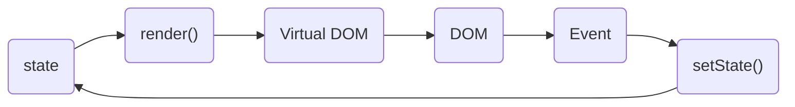
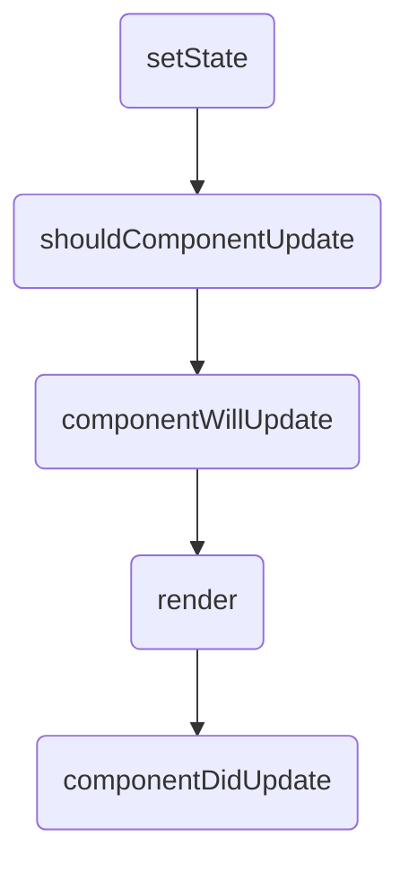
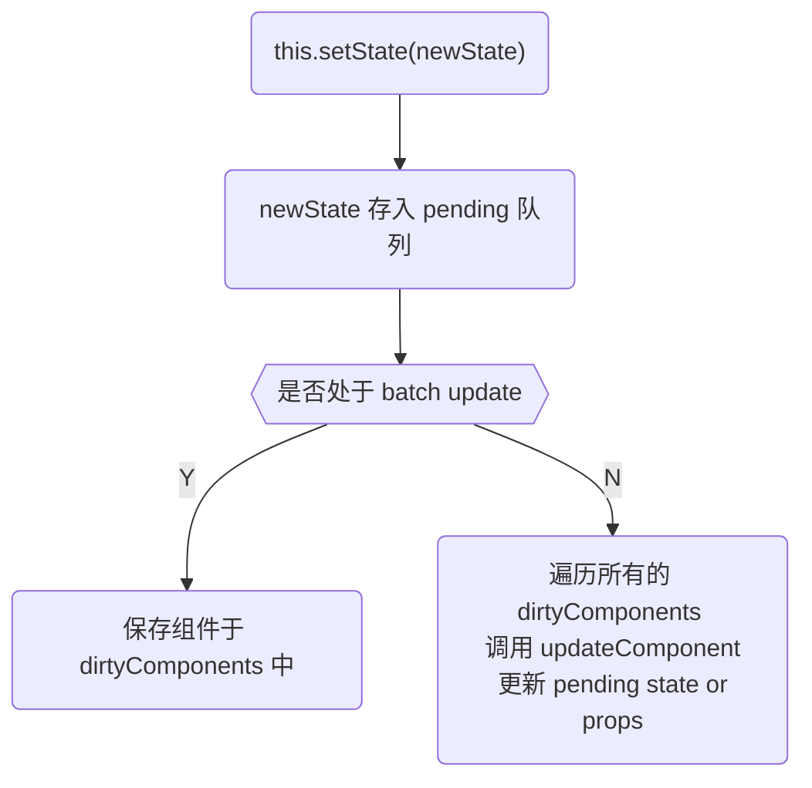
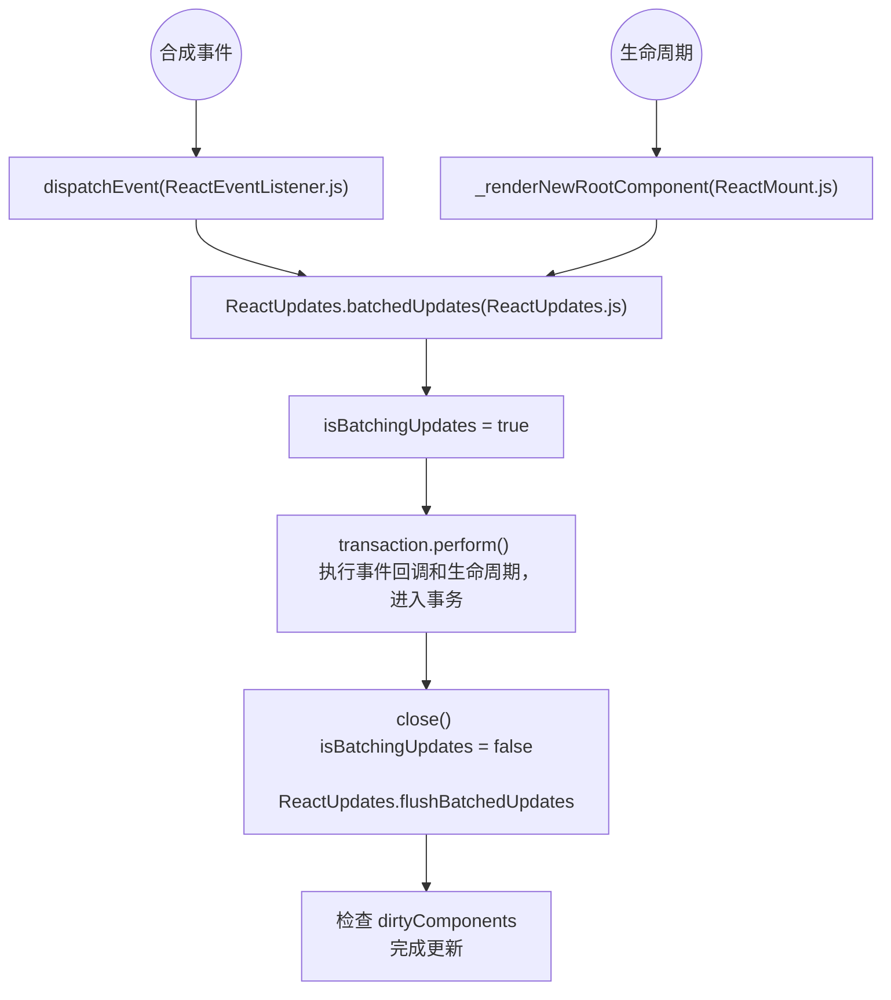

# state “异步”



这是一个 React 组件实现组件可交互所需的流程，`render()` 输出虚拟 DOM，虚拟 DOM 转为 DOM，再在 DOM 上注册事件，事件触发 `setState()` 修改数据，在每次调用 setState 方法时，React 会自动执行 `render` 方法来更新虚拟 DOM，如果组件已经被渲染，那么还会更新到 DOM 中去。<sub>[6]</sub>

## 1.`setState()` <sub>[1]</sub>

```jsx
setState(updater[, callback])
```

`setState()` 将对组件 state 的更改排入队列，并通知 React 需要使用更新后的 state 重新渲染此组件及其子组件。这是用于更新用户界面以响应事件处理器和处理服务器数据的主要方式。

将 `setState()` 视为【请求】而不是【立即更新组件的命令】。为了更好的感知性能，React 会延迟调用它，然后通过一次传递更新多个组件。React 并不会保证 state 的变更会立即生效。

`setState()` 并不总是立即更新组件。它会批量推迟更新。这使得在调用 `setState()` 后立即读取 `this.state` 成为了隐患。为了消除隐患，请使用 `componentDidUpdate` 或者 `setState` 的回调函数（`setState(updater, callback)`），这两种方式都可以保证在应用更新后触发。

```jsx
this.setState((state, props) => {
  return {
    count: state.count + props.count
  }
}, () => {
  if (this.state.count) {
    this.setState({
      text: 'Jarry'
    })
  } else {
    this.setState({
      text: 'stranger'
    })
  }
})

// componentDidUpdate(若要在 componentDidUpdate 使用 setState，必须包含在一个 if 条件中)
// 不能在一个一直都能满足的条件中使用 setState，否则会造成死循环
componentDidMount(){
  this.setState((state, props) => ({ count: state.count + props.count }))
}

componentDidUpdate(prevProps, prevState) {
  if (this.state.count === prevProps.count + prevState.count) {
    this.setState({
      text: 'Jarry'
    })
  } else {
    // Error: Maximum update depth exceeded.
    this.setState({
      text: 'Tom'
    })
  }
}
```

> 除非 `shouldComponentUpdate()` 返回 `false`，否则 `setState()` 将始终执行重新渲染操作。如果可变对象被使用，且无法在 `shouldComponentUpdate()` 中实现条件渲染，那么仅在新旧状态不一时调用 `setState()` 可以避免不必要的重新渲染。

参数一为带有形式参数的 `updater` 函数：

```jsx
(state, props) => stateChange
```

`state` 是对应用变化时组件状态的引用。当然，它不应直接被修改。你应该使用基于 `state` 和 `props` 构建的新对象来表示变化。例如，假设我们想根据 `props.step` 来增加 `state`：

```jsx
this.setState((state, props) => {
  return {counter: state.counter + props.step};
});
```

`updater` 函数中接收的 `state` 和 `props` 都保证为最新。`updater` 的返回值会与 `state` 进行浅合并。

`setState()` 的第二个参数为可选的回调函数，它将在 `setState` 完成合并并重新渲染组件后执行。通常，我们建议使用 `componentDidUpdate()` 来代替此方式。

`setState()` 的第一个参数除了接受函数外，还可以接受对象类型：

```jsx
setState(stateChange[, callback])
```

`stateChange` 会将传入的对象浅层合并到新的 `state` 中，例如，调整购物车商品数：

```jsx
this.setState({quantity: 2})
```

这种形式的 `setState()` 也是异步的，并且在同一周期内会对多个 `setState` 进行批处理。例如，如果在同一周期内多次设置商品数量增加，则相当于：

```js
Object.assign(
  previousState,
  {quantity: state.quantity + 1},
  {quantity: state.quantity + 1},
  ...
)
```

后调用的 `setState()` 将覆盖同一周期内先调用 `setState` 的值，因此商品数仅增加一次。如果后续状态取决于当前状态，我们建议使用 `updater` 函数的形式代替：

```jsx
this.setState((state) => {
  return {quantity: state.quantity + 1};
});
```

## 2.真的是“异步”吗 <sub>[5]</sub>

1.setState 只在【合成事件】和【钩子函数】中是“异步”的，在【原生事件】和 setTimeout 中都是同步的。

> 原生自带的事件监听 `addEventListener`，或者也可以用原生 js、jq 直接 `document.querySelector().onclick` 这种绑定事件的形式都属于原生事件。

2.setState 的“异步”并不是说内部由异步代码实现，其实本身执行的过程和代码都是同步的，只是【合成事件】和【钩子函数】的调用顺序在更新之前，导致在【合成事件】和【钩子函数】中没法立马拿到更新后的值，形成了所谓的“异步”，当然可以通过第二个参数 `setState(partialState, callback)` 中的 callback 拿到更新后的结果。

3.setState 的批量更新优化也是建立在“异步”（合成事件、钩子函数）之上的，在【原生事件】和 setTimeout 中不会批量更新，在“异步”中如果对同一个值进行多次 setState， setState 的批量更新策略会对其进行覆盖，取最后一次的执行，如果是同时 setState 多个不同的值，在更新时会对其进行合并批量更新。

## 3.为什么是“异步”的 <sub>[3]</sub>

### 3.1.Guaranteeing Internal Consistency

> Guaranteeing Internal Consistency 保证内部一致性

Even if state is updated synchronously, props are not. (You can’t know props until you re-render the parent component, and if you do this synchronously, batching goes out of the window.)
(如果是同步)即使 state 被同步更新，props 也不会被更新。（除非重新渲染父组件，否则将不知道 props 状态，并且如果同步进行渲染，则批处理将无法进行。）

Right now the objects provided by React (state, props, refs) are internally consistent with each other. This means that if you only use those objects, they are guaranteed to refer to a fully reconciled tree (even if it’s an older version of that tree). Why does this matter?
现在，React 提供的对象（state, props, refs）在内部彼此一致。这意味着如果仅使用这些对象，则可以确保它们引用的是完全协调的树（即使该树是该树的旧版本）。为什么这么重要？

When you use just the state, if it flushed synchronously (as you proposed), this pattern would work:
当仅使用 state 时，如果它同步刷新（如您所建议的），则此模式将起作用：

```jsx
console.log(this.state.value) // 0
this.setState({ value: this.state.value + 1 });
console.log(this.state.value) // 1
this.setState({ value: this.state.value + 1 });
console.log(this.state.value) // 2
```

However, say this state needs to be lifted to be shared across a few components so you move it to a parent:
但是，如果需要在几个组件之间共享此状态，则需要将其转移到父组件：

```jsx
-this.setState({ value: this.state.value + 1 });
+this.props.onIncrement(); // Does the same thing in a parent
```

I want to highlight that in typical React apps that rely on `setState()` this is **the single most common kind of React-specific refactoring that you would do on a daily basis**.
我要强调的是，在依赖 `setState()` 的典型 React 应用程序中，**这是每天都会执行的最常见的一种 React 特定重构**。

However, this breaks our code!
然而下面的代码却不能按预期工作!

```jsx
console.log(this.props.value) // 0
this.props.onIncrement();
console.log(this.props.value) // 0
this.props.onIncrement();
console.log(this.props.value) // 0
```

This is because, in the model you proposed, `this.state` would be flushed immediately but `this.props` wouldn’t. And we can’t immediately flush `this.props` without re-rendering the parent, which means we would have to give up on batching (which, depending on the case, can degrade the performance very significantly).
这是因为在同步模型中，会立即更新 `this.state`，但不会立即更新 `this.props`。而且我们不能在不重新渲染父级的情况下立即更新 `this.props`，这意味着我们将不得不放弃批处理（根据情况的不同，批处理会大大降低性能）。

There are also more subtle cases of how this can break, e.g. if you’re mixing data from props (not yet flushed) and state (proposed to be flushed immediately) to create a new state: [#122 (comment)](https://github.com/facebook/react/issues/122#issuecomment-81856416). Refs present the same problem: [#122 (comment)](https://github.com/facebook/react/issues/122#issuecomment-22659651).
还有一些更微妙的情况可以解决这个问题，例如: 如果要混合 props（尚未更新）和 state（建议立即更新）中的数据以创建新 state [state：＃122（comment）](https://github.com/facebook/react/issues/122#issuecomment-81856416)。refs 也出了同样的问题：[state：＃122（comment）](https://github.com/facebook/react/issues/122#issuecomment-22659651)。

These examples are not at all theoretical. In fact React Redux bindings used to have exactly this kind of problem because they mix React props with non-React state: [reduxjs/react-redux#86](https://github.com/reduxjs/react-redux/issues/86), [reduxjs/react-redux#99](https://github.com/reduxjs/react-redux/pull/99), [reduxjs/react-redux#292](https://github.com/reduxjs/react-redux/issues/292), [reduxjs/redux#1415](https://github.com/reduxjs/redux/issues/1415), [reduxjs/react-redux#525](https://github.com/reduxjs/react-redux/issues/525).
这些例子完全不是理论上的。实际上，React Redux 绑定曾经存在这种问题，因为它们将 React props 与 non-React state 混合在一起：[reduxjs/react-redux#86](https://github.com/reduxjs/react-redux/issues/86), [reduxjs/react-redux#99](https://github.com/reduxjs/react-redux/pull/99), [reduxjs/react-redux#292](https://github.com/reduxjs/react-redux/issues/292), [reduxjs/redux#1415](https://github.com/reduxjs/redux/issues/1415), [reduxjs/react-redux#525](https://github.com/reduxjs/react-redux/issues/525)。

I don’t know why MobX users haven’t bumped into this, but my intuition is that they might be bumping into such scenarios but consider them their own fault. Or maybe they don’t read as much from `props` and instead read directly from MobX mutable objects instead.
我不知道为什么 MobX 用户没有遇到这种情况，但我的直觉是他们可能会遇到这种情况，但认为这是他们自己是错的(译注：即用户没有意识到这是 MobX 自身的错误)。或者，也许他们从 props 中读取的内容不多，而是直接从 MobX 可变对象中读取。

So how does React solve this today? **In React, both this.state and this.props update only after the reconciliation and flushing, so you would see 0 being printed both before and after refactoring**. This makes lifting state up safe.
那么 React 今天如何解决这个问题呢？在 React 中，`this.state` 和 `this.props` 都仅在协调和刷新之后更新，因此将看到在重构前后都打印了 0。这使得提升状态变得安全。

Yes, this can be inconvenient in some cases. Especially for folks coming from more OO backgrounds who just want to mutate state several times instead of thinking how to represent a complete state update in a single place. I can empathize with that, although I do think that keeping state updates concentrated is clearer from a debugging perspective: [#122 (comment)](https://github.com/facebook/react/issues/122#issuecomment-19888472).
在某些情况下这可能会带来不便。特别是对于来自更多面向对象背景的人们，他们只想对状态进行多次更改，而不是考虑如何在一个地方表示完整的状态更新。 我可以对此表示同情，尽管我确实认为从调试的角度来看，保持状态更新集中更为清楚：[#122 (comment)](https://github.com/facebook/react/issues/122#issuecomment-19888472)。

Still, you have the option of moving the state that you want to read immediately into some sideways mutable object, especially if you don’t use it as a source of truth for rendering. Which is pretty much what MobX lets you do 🙂.
不过，您仍然可以选择将要立即读取的状态移动到某些侧向可变对象中，特别是如果您不将其用作渲染的真实来源的情况下。MobX 可以让您完成🙂。

You also have an option to flush the entire tree if you know what you’re doing. The API is called `ReactDOM.flushSync(fn)`. I don’t think we have documented it yet, but we definitely will do so at some point during the 16.x release cycle. Note that it actually forces complete re-rendering for updates that happen inside of the call, so you should use it very sparingly. This way it doesn’t break the guarantee of internal consistency between `props`, `state`, and `refs`.
如果您知道自己在做什么，还可以选择刷新整个树。该 API 称为 `ReactDOM.flushSync（fn）`。我认为我们尚未对此进行记录，但是我们肯定会在 16.x 发行周期的某个时候进行记录。请注意，它实际上会强制完全重新呈现呼叫内部发生的更新，因此您应该非常谨慎地使用它。这样一来，就不会破坏 props, state, and refs 之间内部一致性的保证。

To sum up, the React model doesn’t always lead to the most concise code, but it is internally consistent and ensures lifting state up is safe.
总而言之，React 模型并不总是能生成最简洁的代码，但是它在内部是一致的，并且可以确保提升状态是安全的。

## 3.2.Enabling Concurrent Updates

> Enabling Concurrent Updates 启用并发更新

Conceptually, React behaves as if it had a single update queue per component. This is why the discussion makes sense at all: we discuss whether to apply updates to `this.state` immediately or not because we have no doubts the updates will be applied in that exact order. However, that needn’t be the case (haha).
从概念上讲，React 的行为就像每个组件只有一个更新队列一样。这就是为什么讨论完全有意义的原因：我们讨论是否立即对 `this.state` 应用更新，因为我们毫无疑问地认为更新将会按照该确切顺序应用。但是，事实并非如此（哈哈）。

Recently, we’ve been talking about “async rendering” a lot. I admit we haven’t done a very good job at communicating what that means, but that’s the nature of R&D: you go after an idea that seems conceptually promising, but you really understand its implications only after having spent enough time with it.
最近，我们一直在谈论“异步渲染”。我承认我们在传达其含义方面做得并不出色，但这就是研发的本质：您追求的想法在概念上看似很有希望，但只有在花了足够的时间后才真正理解它的含义。

One way we’ve been explaining “async rendering” is that **React could assign different priorities to `setState()` calls depending on where they’re coming from: an event handler, a network response, an animation, etc**.
我们一直在解释“异步渲染”的一种方式是：React 可以根据来自何处的 `setState()` 调用分配不同的优先级：事件处理程序，网络响应，动画等。

For example, if you are typing a message, `setState()` calls in the `TextBox` component need to be flushed immediately. However, if you receive a new message while you’re typing, it is probably better to delay rendering of the new `MessageBubble` up to a certain threshold (e.g. a second) than to let the typing stutter due to blocking the thread.
例如，如果要键入消息，则需要立即刷新 `TextBox` 组件中的 `setState()` 调用。但是，如果您在键入时收到新消息，则最好将新 `MessageBubble` 的呈现延迟到某个阈值（例如，一秒钟），而不是由于阻塞线程而导致键入中断。

If we let certain updates have “lower priority”, we could split their rendering into small chunks of a few milliseconds so they wouldn’t be noticeable to the user.
如果我们让某些更新具有“较低的优先级”，则可以将其呈现结果分成几毫秒的小块，这样用户就不会注意到它们。

I know performance optimizations like this might not sound very exciting or convincing. You could say: “we don’t need this with MobX, our update tracking is fast enough to just avoid re-renders”. I don’t think it’s true in all cases (e.g. no matter how fast MobX is, you still have to create DOM nodes and do the rendering for newly mounted views). Still, if it were true, and if you consciously decided that you’re okay with always wrapping objects into a specific JavaScript library that tracks reads and writes, maybe you don’t benefit from these optimizations as much.
我知道这样的性能优化可能听起来并不令人兴奋或令人信服。您可能会说：“ MobX 不需要此功能，我们的更新跟踪速度足够快，可以避免重新渲染。” 我认为并非在所有情况下都是如此（例如，无论 MobX 有多快，您仍然必须创建 DOM 节点并为新安装的视图进行渲染）。不过，如果这是真的（译注：指不进行/不需要“较低的优先级”优化策略），并且您有意识地决定始终将对象包装到跟踪读写的特定 JavaScript 库中，那么您可能不会从这些优化中受益匪浅。

**But asynchronous rendering is not just about performance optimizations. We think it is a fundamental shift in what the React component model can do.**
但是异步渲染不仅仅涉及性能优化。我们认为这是 React 组件模型可以做什么的根本转变。

For example, consider the case where you’re navigating from one screen to another. Typically you’d show a spinner while the new screen is rendering.
例如，考虑从一个页面导航到另一个页面的情况。通常，您会在新页面呈现时显示加载动画。

However, if the navigation is fast enough (within a second or so), flashing and immediately hiding a spinner causes a degraded user experience. Worse, if you have multiple levels of components with different async dependencies (data, code, images), you end up with a cascade of spinners that briefly flash one by one. This is both visually unpleasant and makes your app slower in practice because of all the DOM reflows. It is also the source of much boilerplate code.
但是，如果导航足够快（在一秒钟左右），则闪烁并立即隐藏加载动画会降低用户体验。更糟糕的是，如果您拥有具有不同异步依赖关系（数据，代码，图像）的多个级别的组件，则最终会看到一堆加载动画，它们会一一短暂地闪烁。由于所有 DOM 的重排，这在视觉上都是令人不快的，并且会使您的应用在实践中变慢。它也是许多样板代码的来源。

Wouldn’t it be nice if when you do a simple `setState()` that renders a different view, we could “start” rendering the updated view “in background”? Imagine that without any writing any coordination code yourself, you could choose to show a spinner if the update took more than a certain threshold (e.g. a second), and otherwise let React perform a seamless transition when the async dependencies of the whole new subtree are satisfied. Moreover, while we’re “waiting”, the “old screen” stays interactive (e.g. so you can choose a different item to transition to), and React enforces that if it takes too long, you have to show a spinner.
如果当您执行一个简单的 `setState()` 来呈现不同的视图时，我们可以“开始”“在幕后”呈现更新的视图，那岂不是很好吗？想象一下，您自己无需编写任何协调代码，如果更新花费的时间超过某个特定阈值（例如，一秒钟），您可以选择显示一个加载动画，否则在新页面准备好后，让 React 执行一个无缝的切换。此外，在我们“等待”期间，“旧页面”保持互动状态（例如，您可以选择其他项目来过渡），React 强制要求，如果花费的时间太长，则必须显示一个加载动画。

It turns out that, with current React model and [some adjustments to lifecycles](https://github.com/reactjs/rfcs/pull/6), we actually can implement this!
事实证明，使用当前的 React 模型和对生命周期的一些调整，我们实际上可以实现这一目标！

Note that this is only possible because `this.state` is not flushed immediately. If it were flushed immediately, we’d have no way to start rendering a “new version” of the view in background while the “old version” is still visible and interactive. Their independent state updates would clash.
请注意，这仅是可能的，因为 `this.state` 不会立即刷新。如果立即将其刷新，我们将无法开始在幕后渲染视图的“新版本”，而“旧版本”仍然可见并且可以交互。他们的独立状态更新会发生冲突。

And as far as I understand, at least in part this flexibility is possible thanks to not flushing state updates immediately.
据我了解，至少由于不立即刷新状态更新，这种灵活性至少可以实现。

> The key to understanding this is that no matter how many `setState()` calls in how many components you do inside a React event handler, they will produce only a single re-render at the end of the event. This is crucial for good performance in large applications because if Child and Parent each call `setState()` when handling a click event, you don't want to re-render the Child twice. <sub>[4]</sub>
> 理解这一点的关键是，无论您在 React 事件处理程序中使用多少个 `setState()` 调用了多少个组件，它们在事件结束时只会产生一次重新渲染。对于大型应用程序而言，良好的性能是至关重要，因为如果 Child 和 Parent 在处理单击事件时分别调用 `setState()`，则您将不得不进行两次重新渲染 Child。

我们再来看看 setState 引发组件的更新过程：



每一次 setState 如果都引发一次组件更新，走完一圈生命周期，实在是有点粗糙和浪费，生命周期函数为纯函数性能应当还能够接受，可是 `render` 函数内返回的虚拟 DOM 去做比较这个就比较费时间了。直观的感受是，React 将多个 setState 产生的修改放在一个队列里，缓一缓，攒在一起，等待时机，觉得差不多了再引发一次更新过程。这样，在每次更新过程中，会把积攒的 setState 结果合并，做一个 merge 的动作，节省 render 触发的频率。这样，对于开发者而言，可以在同步代码中随意多行调用 setState 函数而不用担心重复 setState 重复 render 的问题。<sub>[6]</sub>

## 4.怎么实现“异步”

在 React 的 setState 函数实现中，会根据一个变量 `isBatchingUpdates` 判断是直接更新 `this.state` 还是放到队列中回头再说，而 `isBatchingUpdates` 默认是 `false`，也就表示 setState 会同步更新 `this.state`，但是，有一个函数 `batchedUpdates`，这个函数会把 `isBatchingUpdates` 修改为 `true`，而当 React 在调用事件处理函数和自身生命周期之前就会调用这个 `batchedUpdates`，造成的后果，就是由 React 控制的事件处理过程和生命周期中的同步代码调用的 setState 不会同步更新 `this.state`。所以按照正常 React 用法都是会经过 `batchedUpdates` 方法的。这是由于 React 有一套自定义的事件系统和生命周期流程控制，使用原生事件监听和 `setTimeout` 这种方式会跳出 React 这个体系，所以会直接更新 `this.state`。<sub>[6]</sub>

### 4.1.合成事件 <sub>[8]</sub>

react 为了解决跨平台，兼容性问题，自己封装了一套事件机制，代理了原生的事件，像在 jsx 中常见的 `onClick`、`onChange` 这些都是合成事件。

### 4.2.事务 <sub>[6]</sub>

React 中的事务借用了计算机专业术语的单词 **`Transaction`**。对比数据库的事务性质，两者之间有共同点却又不是一回事。简单来说，把需要执行的方法用一个容器封装起来，在容器内执行方法的前后，分别执行 `init` 方法和 `close` 方法，其次来说，一个容器可以包裹另一个容器，这点又类似于洋葱模型。

React 的合成事件系统和生命周期就使用了 React 内部实现的事务，为其函数附加了前后两个类似 npm 脚本 pre 和 post 两个钩子的事件。

这是一个 npm srcipt 的例子：

```shell
"prebuild": "echo I run before the build script",
"build": "cross-env NODE_ENV=production webpack",
"postbuild": "echo I run after the build script"

# 用户执行 npm run build 就会实际执行
npm run prebuild && npm run build && npm run postbuild

# 因此可以在两个钩子里做一些准备工作和清理工作。
```

所以，我们可以得到启发，React 的事件系统和生命周期事务前后的钩子对 `isBatchingUpdates` 做了修改，其实就是在事务的前置 pre 内调用了 `batchedUpdates` 方法修改了变量为 `true`，然后在后置钩子又置为 `false`，然后发起真正的更新检测，而事务中异步方法运行时候，由于 JavaScript 的异步机制，异步方法（`setTimeout` 等）其中的 setState 运行时候，同步的代码已经走完，后置钩子已经把 `isBatchingUpdates` 设为 `false`，所以此时的 setState 会直接进入非批量更新模式，表现在我们看来成为了同步 SetState。

尝试在描述一下：整个 React 的每个生命周期和合成事件都处在一个大的事务当中。原生绑定事件和 `setTimeout` 异步的函数没有进入React的事务当中，或者是当他们执行时，刚刚的事务已经结束了，后置钩子触发了，close 了。

React “坐”在顶部调用堆栈框架并知道所有 React 事件处理程序何时运行，setState 在 React 管理的合成事件或者生命周期中调用，它会启用批量更新事务，进入了批量更新模式，所有的 setState 的改变都会暂存到一个队列，延迟到事务结束再合并更新。如果 setState 在 React 的批量更新事务外部或者之后调用，则会立即刷新。

懂得了事务，再回看，就明白，其实 setState 从来都是同步运行，不过是 React 利用事务工具方法模拟了 setState 异步的假象。

## 5.部分源码解析

### 5.1 基础 <sub>[6][7]</sub>



首先，我们看下 setState 何处被赋值:

```jsx
// src/isomorphic/modern/class/ReactComponent.js

/*
 * React 组件继承自 React.Component，而 setState 是 React.Component 的方法，
 * 因此对于组件来讲 setState 属于其原型方法，首先看 setState 的定义:
 */
ReactComponent.prototype.setState = function(partialState, callback) {
  // 忽略调入参验证和开发抛错

  // 调用 setState 实际是调用了 enqueueSetState
  // 调用队列的入队方法，把当前组件的实例和 state 存进入
  this.updater.enqueueSetState(this, partialState);
  if (callback) {
    // 如果有回调，把回调存进 setState 队列的后置钩子
    this.updater.enqueueCallback(this, callback, 'setState');
  }
};
```

会发现调用 setState 实际是调用 `this.updater.enqueueSetState`，此时我们不得不看一看 `updater` 及其 `enqueueSetState` 方法是什么东西，我们在当前文件搜索：

```jsx
function ReactComponent(props, context, updater) {
  this.props = props;
  this.context = context;
  this.refs = emptyObject;

  // updater 有默认值，真实运行时会注入，其实也算依赖注入
  this.updater = updater || ReactNoopUpdateQueue;
}
```

`ReactNoopUpdateQueue` 是一个这样的对象，提供了基本的无效方法，真正的 `updater` 只有在 React 被真正加载前才会被注入进来，运行时注入，严格来说是依赖注入，是 React 源码的风格之一。

```jsx
// src/isomorphic/modern/class/ReactNoopUpdateQueue.js
/**
 * This is the abstract API for an update queue.
 */
var ReactNoopUpdateQueue = {
  isMounted: function(publicInstance) {
    return false;
  },
  enqueueCallback: function(publicInstance, callback) { },
  enqueueForceUpdate: function(publicInstance) { },
  enqueueReplaceState: function(publicInstance, completeState) { },
  enqueueSetState: function(publicInstance, partialState) { },
}
```

真实的 `enqueueSetState` 在这个文件内，方法把将要修改的 state 存入组件实例的 `internalInstance` 数组中，这里就是 state 的延迟更新队列了。然后立马调用了一个全局的 `ReactUpdates.enqueueUpdate(internalInstance)` 方法。

```jsx
// src/renderers/shared/reconciler/ReactUpdateQueue.js

// 这个是 setState 真正调用的函数
enqueueSetState: function(publicInstance, partialState) {
  var internalInstance = getInternalInstanceReadyForUpdate(
    publicInstance,
    'setState'
  );

  if (!internalInstance) {
    return;
  }

  // 更新队列合并操作 更新 internalInstance._pendingStateQueue
  var queue = internalInstance._pendingStateQueue ||(internalInstance._pendingStateQueue = []);
  queue.push(partialState);

  enqueueUpdate(internalInstance);
},
```

我们来猜下 `ReactUpdates.enqueueUpdate` 干了什么？根据上面的流程图我猜想应当是判断流程。

```jsx
function enqueueUpdate(component) {
  // 环境判断：是否有调度事务方法同时有批量更新策略方法
  ensureInjected()

  // 关键的判断条件，是否是批量更新
  // 可是 isBatchingUpdates 这个值谁来维护呢？
  if (!batchingStrategy.isBatchingUpdates) {
    // 如果不是批量更新，猜想一下，应该会立即更新吧？
    // 唉？batchingStrategy 到底在做什么呢
    // 调用事务
    // 对队列中的更新执行 batchedUpdates 方法
    batchingStrategy.batchedUpdates(enqueueUpdate, component)
    return;
  }

  // 如果是批量更新，那就把组件放入脏组件队列，也就是待更新组件队列
  dirtyComponents.push(component)
}
```

需要看 `ReactDefaultBatchingStrategy.js` 看 `batchedUpdates` 方法，这个 js 文件就有意思了，一上来就是我们之前提到的事务。

```jsx
// /src/renderers/shared/reconciler/ReactDefaultBatchingStrategy.js

function ReactDefaultBatchingStrategyTransaction() {
  this.reinitializeTransaction();
}

// ...

var transaction = new ReactDefaultBatchingStrategyTransaction();

var ReactDefaultBatchingStrategy = {
  isBatchingUpdates: false,

  /**
   * Call the provided function in a context within which calls to `setState`
   * and friends are batched such that components aren't updated unnecessarily.
   */
  batchedUpdates: function(callback, a, b, c, d, e) {
    var alreadyBatchingUpdates = ReactDefaultBatchingStrategy.isBatchingUpdates;

    ReactDefaultBatchingStrategy.isBatchingUpdates = true;

    // The code is written this way to avoid extra allocations
    if (alreadyBatchingUpdates) {
      callback(a, b, c, d, e);
    } else {
      transaction.perform(callback, null, a, b, c, d, e);
    }
  }
}
```

避免枯燥，我用人话阐述一下这个 js 的内容，也可以直接看 [ReactDefaultBatchingStrategy.js](https://github.com/94dreamer/react-source/blob/3ae3711909da9b116a8ebbed88ae50d9342e661d/src/renderers/shared/reconciler/ReactDefaultBatchingStrategy.js)

文件底部声明了 `ReactDefaultBatchingStrategy` 对象，内部 `isBatchingUpdates` 初始值为 `false`，这个就是我们心心念念判断是否在批量更新策略的重要变量。

这个 `isBatchingUpdates` 变量搜索整个项目，发现它只被两处改变：

1. 对象自身的另一个 `batchedUpdates` 方法固定赋值为 `true`，标识着开启批量更新策略。
2. 一个事务的 `close` 钩子，设为 `false`，标识着结束批量更新策略。恰好，这个事务被 `batchedUpdates` 调用。

实质上，`isBatchingUpdates` 仅仅也就是被 `batchedUpdates` 方法维护着，`batchedUpdates` 调用时开启批量更新，同时入参 callback 被事务包裹调用，callback 调用完成时候事务 `close` 钩子触发，关闭批量更新模式。事务的 `close` 钩子函数有两个，另一个之前会调用 `ReactUpdates.flushBatchedUpdates` 方法，也就是真正的把积攒的 `setState` 队列进行更新计算。

问题来了，`callback` 是啥，`batchedUpdates` 方法在 `setState` 之前，或者说除了 `setState` 还会被谁调用，导致 `isBatchingUpdates` 变为 `true`，我猜想是生命周期函数和合成事件，只有这样，整个维护批量更新策略的机制就形成了闭环，验证了我们之前的结论。

我们搜索 `batchedUpdates`，果不其然，在 `src/renderers/dom/client/ReactEventListener.js` 和 `src/renderers/dom/client/ReactMount.js` 中找到了 `ReactUpdates.batchedUpdates` 的调用。

合成事件和生命周期的装载发生时，调用了 `batchedUpdates` 方法，使得内部的同步代码都可以运行在批量更新策略的事务环境中，结束后，便使用事务的后置钩子启动 `merge` 更新，重置常量。

另外我在 `ReactDOM.js` 发现了对 React 顶层 API 对 `batchedUpdates` 方法的引用，可以让 Promise 这些异步也能进入 `batch update`：

```jsx
unstable_batchedUpdates: ReactUpdates.batchedUpdates
```

另一个彩蛋，虽然 React 不提倡使用这个 API，以后版本也可能移除(在 React 15.0 之后的版本已经将 batchedUpdates 彻底移除了)，但是现在我们可以这样在 React 中这样使用：

```jsx
React.unstable_batchedUpdates(function(){
    this.setState({...})
    this.setState({...})
    //...在此函数内也可以使用批量更新策略
})
```

解决了 `setTimeout` 和 AJAX 异步方法、原生事件内的 setState 批量更新策略失效的问题，让批量更新在任何场景都会发生。

**小结**



1. `this.setState` 首先会把 state 推入 `pendingState` 队列中。

2. 然后将组件标记为 `dirtyComponent`。

3. React 中有事务的概念，最常见的就是更新事务，如果不在事务中，则会开启一次新的更新事务，更新事务执行的操作就是把组件标记为 `dirty`。

4. 判断是否处于 `batch update`。

5. 是的话，保存组件于 `dirtyComponents` 中，在事务的时候才会通过 `ReactUpdates.flushBatchedUpdates` 方法将所有的临时 state merge 并计算出最新的 props 及 state，然后将其批量执行，最后再关闭结束事务。

6. 不是的话，直接开启一次新的更新事务，在标记为 `dirty` 之后，直接开始更新组件。因此当 setState 执行完毕后，组件就更新完毕了，所以会造成定时器同步更新的情况。

### 5.2 进阶 <sub>[5]</sub>

#### 5.2.1.合成事件中的 setState

```jsx
class App extends Component {

  state = { val: 0 }

  increment = () => {
    this.setState({ val: this.state.val + 1 })
    console.log(this.state.val) // 输出的是更新前的val --> 0
  }
  render() {
    return (
      <div onClick={this.increment}>
        {`Counter is: ${this.state.val}`}
      </div>
    )
  }
}
```

合成事件中的 setState 写法比较常见，点击事件里去改变 `this.state.val` 的状态值，在 `increment` 事件中打个断点可以看到调用栈，这里我贴一张自己画的流程图：


从 `dispatchInteractiveEvent` 到 `callCallBack` 为止，都是对合成事件的处理和执行，从 setState 到 `requestWork` 是调用 `this.setState` 的逻辑，这边主要看下  `requestWork` 这个函数（从 `dispatchEvent` 到 `requestWork` 的调用栈是属于 `interactiveUpdates$1` 的 `try` 代码块，下文会提到）。

```jsx
function requestWork(root, expirationTime) {
  addRootToSchedule(root, expirationTime);

  if (isRendering) {
    // Prevent reentrancy. Remaining work will be scheduled at the end of
    // the currently rendering batch.
    return;
  }

  if (isBatchingUpdates) {
    // Flush work at the end of the batch.
    if (isUnbatchingUpdates) {
      // ...unless we're inside unbatchedUpdates, in which case we should
      // flush it now.
      nextFlushedRoot = root;
      nextFlushedExpirationTime = Sync;
      performWorkOnRoot(root, Sync, false);
    }
    return;
  }

  // TODO: Get rid of Sync and use current time?
  if (expirationTime === Sync) {
    performSyncWork();
  } else {
    scheduleCallbackWithExpiration(expirationTime);
  }
}
```

在 `requestWork` 中有三个 `if` 分支，三个分支中有两个方法 `performWorkOnRoot` 和 `performSyncWork`，就是我们默认的 `update` 函数，但是在合成事件中，走的是第二个 `if` 分支，第二个分支中有两个标识 `isBatchingUpdates` 和 `isUnbatchingUpdates` 两个初始值都为  `false`，但是在 `interactiveUpdates$1` 中会把 `isBatchingUpdates` 设为 true ，下面就是 `interactiveUpdates$1` 的代码：

```jsx
function interactiveUpdates$1(fn, a, b) {
  if (isBatchingInteractiveUpdates) {
    return fn(a, b);
  }
  // If there are any pending interactive updates, synchronously flush them.
  // This needs to happen before we read any handlers, because the effect of
  // the previous event may influence which handlers are called during
  // this event.
  if (!isBatchingUpdates && !isRendering && lowestPendingInteractiveExpirationTime !== NoWork) {
    // Synchronously flush pending interactive updates.
    performWork(lowestPendingInteractiveExpirationTime, false, null);
    lowestPendingInteractiveExpirationTime = NoWork;
  }
  var previousIsBatchingInteractiveUpdates = isBatchingInteractiveUpdates;
  var previousIsBatchingUpdates = isBatchingUpdates;
  isBatchingInteractiveUpdates = true;
  isBatchingUpdates = true;  // 把 requestWork 中的 isBatchingUpdates 标识改为 true
  try {
    return fn(a, b);
  } finally {
    isBatchingInteractiveUpdates = previousIsBatchingInteractiveUpdates;
    isBatchingUpdates = previousIsBatchingUpdates;
    if (!isBatchingUpdates && !isRendering) {
      performSyncWork();
    }
  }
}
```

在这个方法中把 `isBatchingUpdates` 设为了 true ,导致在 `requestWork` 方法中， `isBatchingUpdates` 为 true ，但是 `isUnbatchingUpdates` 是 false ，而被直接 return 了。

那 return 完的逻辑回到哪里呢，最终正是回到了 `interactiveUpdates$` 这个方法，仔细看一眼，这个方法里面有个 [try finally](https://javascript.ruanyifeng.com/grammar/error.html#toc12) 语法，前端同学这个其实是用的比较少的，简单的说就是会先执行 `try` 代码块中的语句，然后再执行 `finally` 中的代码，而 `fn(a, b)` 是在 `try` 代码块中，刚才说到在 `requestWork` 中被 return 掉的也就是这个 fn（上文提到的 从 `dispatchEvent` 到 `requestWork` 的一整个调用栈）。

所以当你在 `increment` 中调用 setState 之后去 `console.log` 的时候，是属于 `try` 代码块中的执行，但是由于是合成事件，`try` 代码块执行完 `state` 并没有更新，所以你输入的结果是更新前的 `state` 值，这就导致了所谓的"异步"，但是当你的 `try` 代码块执行完的时候（也就是你的 `increment` 合成事件），这个时候会去执行 `finally` 里的代码，在 `finally` 中执行了 `performSyncWork` 方法，这个时候才会去更新你的 `state` 并且渲染到UI上。

#### 5.2.2.生命周期函数中的setState

```jsx
class App extends Component {

  state = { val: 0 }

 componentDidMount() {
    this.setState({ val: this.state.val + 1 })
   console.log(this.state.val) // 输出的还是更新前的值 --> 0
 }
  render() {
    return (
      <div>
        {`Counter is: ${this.state.val}`}
      </div>
    )
  }
}
```

钩子函数中setState的调用栈:


其实还是和合成事件一样，当 `componentDidmount` 执行的时候，react 内部并没有更新，执行完 `componentDidmount`  后才去 `commitUpdateQueue` 更新。这就导致你在 `componentDidmount` 中 setState 完去 `console.log` 拿的结果还是更新前的值。

#### 5.2.3.原生事件中的setState

```jsx
class App extends Component {

  state = { val: 0 }

  changeValue = () => {
    this.setState({ val: this.state.val + 1 })
    console.log(this.state.val) // 输出的是更新后的值 --> 1
  }

  componentDidMount() {
    document.body.addEventListener('click', this.changeValue, false)
  }

  render() {
    return (
      <div>
        {`Counter is: ${this.state.val}`}
      </div>
    )
  }
}
```

原生事件是指非 react 合成事件，原生自带的事件监听 `addEventListener` ，或者也可以用原生 js、jq 直接 `document.querySelector().onclick` 这种绑定事件的形式都属于原生事件。


原生事件的调用栈就比较简单了，因为没有走合成事件的那一大堆，直接触发 `click` 事件，到 `requestWork` ,在 `requestWork` 里由于 `expirationTime === Sync` 的原因，直接走了 `performSyncWork` 去更新，并不像合成事件或钩子函数中被 return，所以当你在原生事件中 setState 后，能同步拿到更新后的 state 值。

#### 5.2.4.setTimeout中的setState

```jsx
class App extends Component {

  state = { val: 0 }

  componentDidMount() {
    setTimeout(_ => {
      this.setState({ val: this.state.val + 1 })
      console.log(this.state.val) // 输出更新后的值 --> 1
    }, 0)
 }

  render() {
    return (
      <div>
        {`Counter is: ${this.state.val}`}
      </div>
    )
  }
}
```

在 `setTimeout` 中去 setState 并不算是一个单独的场景，它是随着你外层去决定的，因为你可以在合成事件中 `setTimeout` ，可以在钩子函数中 `setTimeout` ，也可以在原生事件 `setTimeout`，但是不管是哪个场景下，基于 [event loop](https://www.ruanyifeng.com/blog/2013/10/event_loop.html) 的模型下， `setTimeout` 中里去 `setState` 总能拿到最新的 state 值。

举个栗子，比如之前的合成事件，由于你是 `setTimeout(_ => { this.setState()}, 0)` 是在 `try` 代码块中,当你 `try` 代码块执行到 `setTimeout` 的时候，把它丢到列队里，并没有去执行，而是先执行的 `finally` 代码块，等 `finally` 执行完了， `isBatchingUpdates` 又变为了 false ，导致最后去执行队列里的 setState 时候， requestWork 走的是和原生事件一样的 `expirationTime === Sync` if分支，所以表现就会和原生事件一样，可以同步拿到最新的 state 值。

## 6.补充

### 6.1 生命周期中使用setState <sub>[8]</sub>

当调用 setState 时，实际上是会执行 `enqueueSetState` 方法，并会对 `partialState` 及 `_pendingStateQueue` 队列进行合并操作，最终通过 `enqueueUpdate` 执行 state 更新。

而 `performUpdateIfNecessary` 获取 `_pendingElement`、 `_pendingStateQueue`、`_pendingForceUpdate`，并调用 `reaciveComponent` 和 `updateComponent` 来进行组件更新。

但，如果在 `shouldComponentUpdate` 或 `componentWillUpdate` 方法里调用 `this.setState` 方法，就会造成崩溃。这是因为在 `shouldComponentUpdate` 或 `componentWillUpdate` 方法里调用 `this.setState` 时，`this._pendingStateQueue!=null`，则 `performUpdateIfNecessary` 方法就会调用 `updateComponent` 方法进行组件更新，而 `updateComponent` 方法又会调用 `shouldComponentUpdate` 和 `componentWillUpdate` 方法，因此造成循环调用，使得浏览器内存占满后崩溃。

参考：

1.[React.Component](https://zh-hans.reactjs.org/docs/react-component.html#setstate)

2.[Pending state updates may be confusing #122](https://github.com/facebook/react/issues/122)

3.[RFClarification: why is setState asynchronous? #11527](https://github.com/facebook/react/issues/11527#issuecomment-360199710)

4.[Does React keep the order for state updates?](https://stackoverflow.com/questions/48563650/does-react-keep-the-order-for-state-updates/48610973#48610973)

5.[你真的理解setState吗？](https://juejin.im/post/5b45c57c51882519790c7441#heading-0)

6.[浅入深出setState（上篇）](https://segmentfault.com/a/1190000015615057)

7.[浅入深出setState（下篇）](https://segmentfault.com/a/1190000015821018)

8.[深入 setState 机制 #26](https://github.com/sisterAn/blog/issues/26)

9.[为何说setState方法是异步的？](https://segmentfault.com/a/1190000007454080)

10.[3 Reasons why I stopped using React.setState](https://blog.cloudboost.io/3-reasons-why-i-stopped-using-react-setstate-ab73fc67a42e#.hfcnguohj)

11.[React中setState同步更新策略](https://zhuanlan.zhihu.com/p/24781259)

12.[React setState是异步吗](https://lq782655835.github.io/blogs/react/react-code-3.setState.html#setstate%E5%BC%82%E6%AD%A5%E5%AE%9E%E7%8E%B0)

13.[React 中 setState() 为什么是异步的？](https://qianduan.group/posts/5a6ed9480cf6b624d2239c8a)

[揭密React setState](https://imweb.io/topic/5b189d04d4c96b9b1b4c4ed6)
